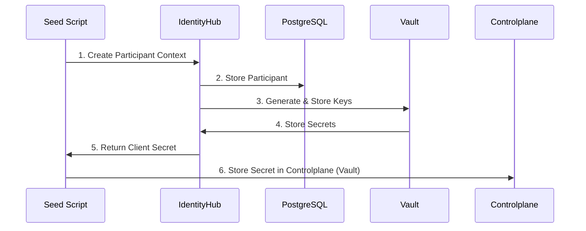
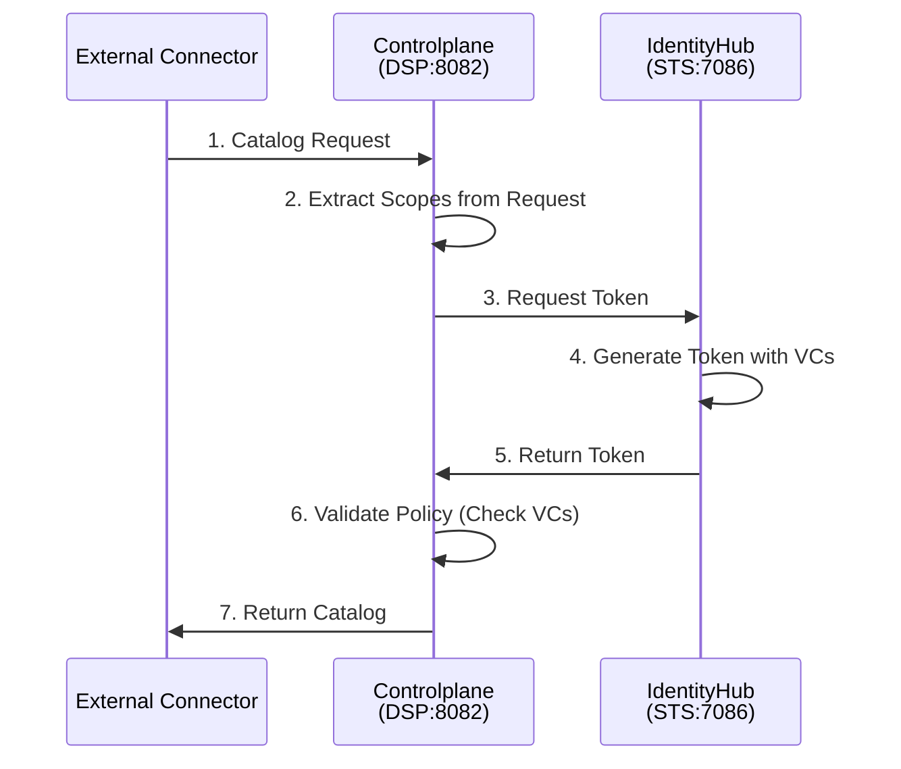
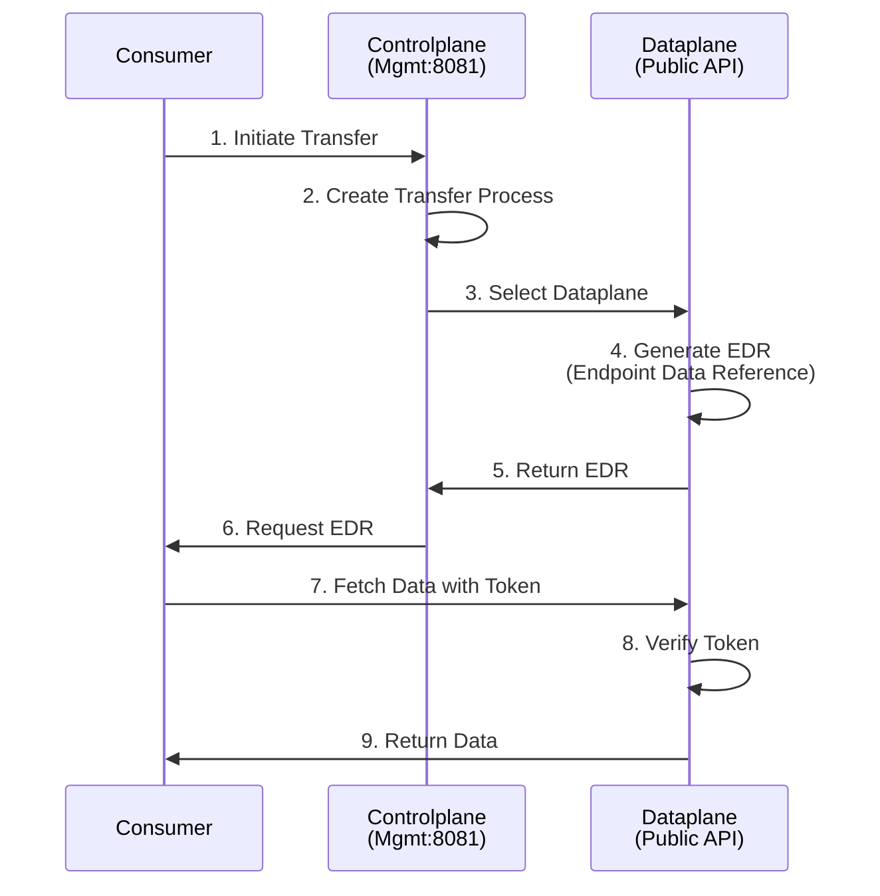

# Architecture Documentation

## Overview

This document describes the architecture of the MVD single-instance Docker Compose deployment, detailing component interactions, data flows, and design decisions.

## System Components

### 1. IdentityHub

**Purpose**: Manages Verifiable Credentials and Decentralized Identifiers (DIDs)

**Responsibilities**:
- Store and serve Verifiable Credentials
- Generate and host DID documents
- Provide Secure Token Service (STS) for issuing access tokens
- Manage participant contexts and keys

**Exposed Ports**:
- 7080: Main API (`/api`)
- 7081: Credentials API (`/api/credentials`)
- 7082: Identity API (`/api/identity`)
- 7083: DID endpoint (`/.well-known/did.json`)
- 7086: STS API (`/api/sts`)
- 1044: Remote debugging

**Configuration**: `config/identityhub.env`

**Data Storage**:
- PostgreSQL: Participant contexts, credentials metadata
- Vault: Private keys, STS secrets
- Volume mounts: Pre-seeded credentials (`/etc/credentials`)

### 2. Controlplane

**Purpose**: Orchestrates contract negotiations and manages policies

**Responsibilities**:
- Handle DSP protocol communications
- Manage assets, policies, and contract definitions
- Orchestrate contract negotiations
- Control dataplane operations
- Maintain federated catalog cache

**Exposed Ports**:
- 8080: Main API (`/api`)
- 8081: Management API (`/api/management`)
- 8082: DSP Protocol endpoint (`/api/dsp`)
- 8083: Control API (`/api/control`)
- 8084: Catalog API (`/api/catalog`)
- 1045: Remote debugging

**Configuration**: `config/controlplane.env`

**Data Storage**:
- PostgreSQL: Assets, policies, contracts, negotiations, transfers
- Vault: STS client secrets, signing keys
- Volume mounts: Participant list (`/etc/participants`)

### 3. Dataplane

**Purpose**: Handles actual data transfers

**Responsibilities**:
- Execute data transfer requests
- Provide public data access endpoint
- Verify access tokens
- Sign data transfer tokens
- Register with controlplane

**Exposed Ports**:
- 11001: Public API (`/api/public`)
- 11002: Control API (`/api/control`)
- 11003: Main API (`/api`)
- 1046: Remote debugging

**Configuration**: `config/dataplane.env`

**Data Storage**:
- PostgreSQL: Transfer state, access tokens
- Vault: Signing keys

### 4. PostgreSQL

**Purpose**: Persistent data storage

**Image**: `postgres:16.3-alpine3.20`

**Database**: `mvd`
**User**: `mvd_user`
**Password**: `mvd_password`

**Port**: 5432

**Initialization**: `scripts/init-db.sql`

**Tables** (auto-created by EDC):
- IdentityHub: `edc_participant_context`, `edc_keypair`, `edc_did_resource`
- Controlplane: `edc_asset`, `edc_policy_definition`, `edc_contract_definition`, `edc_contract_negotiation`, `edc_transfer_process`
- Dataplane: `edc_data_plane_instance`, `edc_accesstokendata`

### 5. HashiCorp Vault

**Purpose**: Secure secret storage

**Image**: `hashicorp/vault:1.17`

**Mode**: Development (root token: `root-token`)

**Port**: 8200

**Stored Secrets**:
- Private keys for signing
- STS client secrets
- Token signing keys

**⚠️ Production Note**: Development mode does NOT persist data. Use proper Vault configuration for production.

## Data Flow Diagrams

### 1. Participant Initialization (Seeding)



### 2. DSP Request Flow (Catalog Request)



### 3. Data Transfer Flow



## Security Architecture

### Authentication & Authorization

1. **Management API**: Token-based (API Key: `password`)
2. **DSP Protocol**: DCP-based with Verifiable Credentials
3. **Dataplane Access**: Token-based with signed EDRs

### Credential Types

- **MembershipCredential**: Proves dataspace membership (required for all DSP requests)
- **DataProcessorCredential**: Proves data processing capability with levels:
  - `processing`: Can process non-sensitive data
  - `sensitive`: Can process sensitive data

### Secret Management

Secrets are stored in HashiCorp Vault:
- Private keys for DID signing
- STS client secrets
- Token signing keys

**Access Pattern**:
```
Service → Vault (HTTP API) → Secret
```

All services use the Vault token (`root-token` in dev mode) to retrieve secrets.

### DID-based Identity

Each participant has a DID (`did:web:identityhub%3A7083`) that:
- Identifies the participant uniquely
- Points to the DID document with public keys
- Enables credential verification

**DID Document Structure**:
```json
{
  "id": "did:web:identityhub%3A7083",
  "@context": ["https://www.w3.org/ns/did/v1"],
  "verificationMethod": [{
    "id": "did:web:identityhub%3A7083#key-1",
    "type": "JsonWebKey2020",
    "controller": "did:web:identityhub%3A7083",
    "publicKeyJwk": { ... }
  }],
  "authentication": ["key-1"]
}
```

## Network Architecture

### Docker Network

All services communicate via the `mvd-network` bridge network.

**Internal Communication**:
- IdentityHub → Vault: `http://vault:8200`
- IdentityHub → PostgreSQL: `jdbc:postgresql://postgres:5432/mvd`
- Controlplane → IdentityHub STS: `http://identityhub:7086/api/sts`
- Controlplane → Vault: `http://vault:8200`
- Controlplane → PostgreSQL: `jdbc:postgresql://postgres:5432/mvd`
- Dataplane → Controlplane: `http://controlplane:8083/api/control`
- Dataplane → Vault: `http://vault:8200`
- Dataplane → PostgreSQL: `jdbc:postgresql://postgres:5432/mvd`

**External Access**:
All services expose ports mapped to `localhost` for development access.

### DNS Resolution

Within Docker network:
- Service names resolve to container IPs
- Example: `identityhub` → `172.x.x.x`

For DID resolution:
- DID `did:web:identityhub%3A7083` maps to `http://identityhub:7083/.well-known/did.json` (internal)
- External access: `http://localhost:7083/.well-known/did.json`

**⚠️ Production Note**: For production, DIDs must be publicly resolvable (e.g., `did:web:connector.example.com`).

## Configuration Management

### Environment Variables

Services are configured via environment files in `config/`:

**Naming Convention**:
- `EDC_*`: EDC framework configuration
- `WEB_HTTP_*`: HTTP endpoint configuration
- `EDC_IAM_*`: Identity and Access Management
- `EDC_VAULT_*`: Vault configuration
- `EDC_DATASOURCE_*`: Database configuration

### Volume Mounts

**Read-Only Mounts**:
- IdentityHub: `/etc/credentials` (pre-seeded VCs)
- Controlplane: `/etc/participants` (participant list)

**Persistent Mounts**:
- PostgreSQL: `/var/lib/postgresql/data`

## Scaling Considerations

### Current Limitations (Single Instance)

- Single instance of each component
- Shared PostgreSQL database
- No load balancing
- Limited to one participant

### Future Scaling Options

1. **Multiple Dataplanes**: Add dataplane instances for horizontal scaling
2. **Database Replication**: Use PostgreSQL replication for redundancy
3. **Vault Clustering**: Use Vault HA mode
4. **Load Balancing**: Add nginx/traefik for load distribution
5. **Multi-Participant**: Run multiple instances with different DIDs

## Monitoring & Observability

### Health Checks

All services expose health endpoints:
- `/api/check/health` - Overall health
- `/api/check/liveness` - Liveness probe
- `/api/check/readiness` - Readiness probe
- `/api/check/startup` - Startup probe

### Logging

Logs are available via:
```bash
docker compose logs -f <service>
```

**Log Levels**: Configured via `JAVA_TOOL_OPTIONS` (default: INFO)

### Metrics

**Current**: Not configured
**Future**: Add Prometheus exporters for metrics collection

## Development Workflow

### Local Development

1. Setup MVD source: `task setup` (automatically clones/updates the repository)
2. Make changes to MVD source at `./edc-mvds`
3. Build images: `task build` (automatically ensures source is up-to-date)
4. Restart services: `task restart`
5. Re-seed if needed: `task seed`

### Debugging

Remote debugging is enabled on all services:
- IdentityHub: `localhost:1044`
- Controlplane: `localhost:1045`
- Dataplane: `localhost:1046`

Configure IDE to connect to these ports.

### Database Inspection

```bash
# Connect to database
task db

# Common queries
\dt                           # List tables
SELECT * FROM edc_asset;      # View assets
SELECT * FROM edc_contract_negotiation;  # View negotiations
```

## Interoperability

### Connecting to Other Participants

1. **Exchange DIDs**: Share your DID and obtain theirs
2. **Add to Participant List**: Update `assets/participants/participants.json`
3. **Configure Policies**: Ensure mutual credential requirements are met
4. **Test DSP Communication**: Query their catalog

### Protocol Compatibility

This deployment implements:
- **DSP (Dataspace Protocol)**: For connector-to-connector communication
- **DCP (Decentralized Claims Protocol)**: For credential presentation
- **W3C Verifiable Credentials**: For access control

### Supported Transfer Types

- `HttpData-PULL`: Consumer pulls data from provider
- `HttpData-PUSH`: Provider pushes data to consumer (not configured by default)

## Backup & Recovery

### Automated Backups

Use `task backup` to create timestamped SQL dumps in `./backups/`

### Manual Backup

```bash
docker compose exec postgres pg_dump -U mvd_user mvd > backup.sql
```

### Recovery

```bash
task restore BACKUP=./backups/mvd-backup-YYYYMMDD-HHMMSS.sql
```

### Disaster Recovery Plan

1. Stop services: `task down`
2. Backup data: `task backup`
3. Restore from backup on new instance
4. Restart services: `task up`
5. Re-seed participant contexts: `task seed`

## Production Deployment Differences

| Aspect | Development (This) | Production |
|--------|-------------------|------------|
| Database | PostgreSQL (local) | Managed PostgreSQL with replication |
| Vault | Dev mode (in-memory) | Vault cluster with persistent storage |
| TLS/HTTPS | HTTP only | TLS for all endpoints |
| DID Resolution | localhost URLs | Public DNS |
| Secrets | Hardcoded | Rotated, managed externally |
| Network | Docker bridge | Kubernetes/Cloud networking |
| Scaling | Single instance | Multiple replicas |
| Monitoring | Basic logs | Full observability stack |
| Backup | Manual | Automated with retention |

## Troubleshooting Guide

### Service Won't Start

**Check**:
1. Logs: `task logs-service SERVICE=<name>`
2. Dependencies: Ensure PostgreSQL and Vault are healthy
3. Port conflicts: `netstat -tulpn | grep <port>`

### Cannot Resolve DID

**Check**:
1. IdentityHub is running: `curl http://localhost:7083/.well-known/did.json`
2. DID format is correct: `did:web:identityhub%3A7083`
3. Network connectivity between services

### Database Connection Failed

**Check**:
1. PostgreSQL is healthy: `task db`
2. Credentials are correct in env files
3. Database is initialized: `\dt` in psql

### Credential Verification Failed

**Check**:
1. Credentials are loaded: Check IdentityHub logs
2. Participant context exists: Query Identity API
3. Public keys match: Compare DID document with stored keys

## References

- [Eclipse Dataspace Components](https://github.com/eclipse-edc/Connector)
- [MVD Documentation](https://github.com/eclipse-edc/MinimumViableDataspace)
- [Dataspace Protocol](https://docs.internationaldataspaces.org/)
- [W3C Verifiable Credentials](https://www.w3.org/TR/vc-data-model/)
- [W3C DIDs](https://www.w3.org/TR/did-core/)
