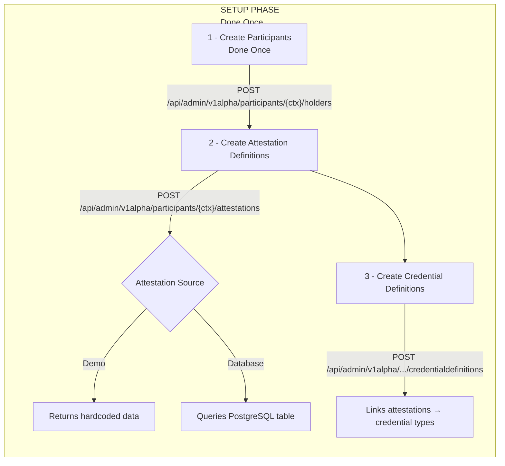
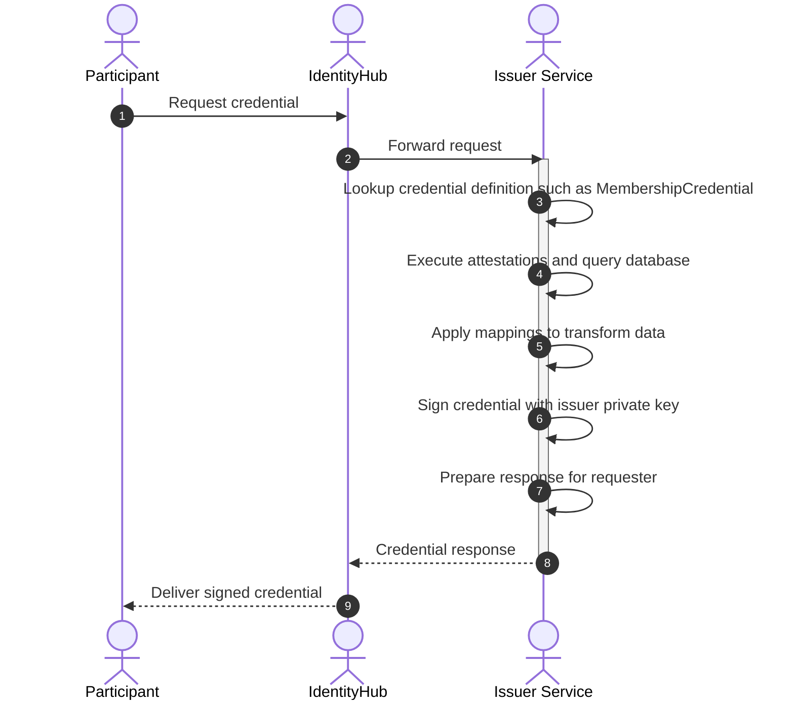

# Issuer Service Deployment Analysis - Complete Docker Compose Migration Guide

## Table of Contents

1. [Overview](#1-overview)
2. [Core Concepts](#2-core-concepts)
3. [Architecture Components](#3-architecture-components)
4. [Configuration Files](#4-configuration-files)
5. [Database Schema & Initialization](#5-database-schema--initialization)
6. [Attestations & Credential Definitions](#6-attestations--credential-definitions)
7. [API Seeding Sequence](#7-api-seeding-sequence)
8. [Docker Compose Architecture](#8-docker-compose-architecture)
9. [Build & Deployment](#9-build--deployment)
10. [Complete Initialization Flow](#10-complete-initialization-flow)
11. [Key Differences from Kubernetes](#11-key-differences-from-kubernetes)
12. [Troubleshooting](#12-troubleshooting)
13. [Production Considerations](#13-production-considerations)

---

## 1. Overview

The Issuer Service in the edc-mvds codebase is responsible for issuing Verifiable Credentials to dataspace participants. This document provides everything needed to migrate from Kubernetes deployment to Docker Compose.

### What the Issuer Service Does

- Issues credentials to participants (e.g., MembershipCredential, DataProcessorCredential)
- Manages attestation sources (evidence backing credential claims)
- Provides credential definitions (templates for credential types)
- Signs credentials using cryptographic keys
- Exposes DID document for verification

---

## 2. Core Concepts

### 2.1 Attestations

**Definition:** Attestations are data sources that provide evidence/claims about a participant.

**Key Points:**

- Attestations are internal to the Issuer Service
- They answer: "How do we verify this claim is true?"
- Multiple attestations can feed one credential
- Attestations ≠ Credentials

#### Attestation Types

| Type     | Purpose                      | Production Ready | Configuration                     |
| -------- | ---------------------------- | ---------------- | --------------------------------- |
| Demo     | Hardcoded test data          | ❌ No             | Minimal                           |
| Database | SQL query against PostgreSQL | ✅ Yes            | Table, datasource, column mapping |

#### Demo Attestation Example

```javascript
// Returns same data for all participants
{
  "onboarding": { "signedDocuments": true },
  "participant": { "name": "Alice" }
}
```

#### Database Attestation Example

```json
{
  "attestationType": "database",
  "configuration": {
    "tableName": "membership_attestations",
    "dataSourceName": "membership",
    "idColumn": "holder_id"
  }
}
```

**Queries:** `SELECT * FROM membership_attestations WHERE holder_id = '<participant-did>'`

---

### 2.2 Credential Definitions

**Definition:** Templates that define how to generate credentials from attestation data.

#### Components

- **Credential Type** (e.g., MembershipCredential) - used in EDC policies
- **Attestation References** - which attestations to query
- **Mappings** - transform attestation data → credential claims
- **Format** - JWT, JSON-LD, etc.
- **Validation Rules** - optional claim validation

#### Example

```json
{
  "id": "membership-cred-def",
  "credentialType": "MembershipCredential",
  "attestations": ["db-attestation-def-1"],
  "mappings": [
    {
      "input": "membership_type", // From attestation
      "output": "credentialSubject.membershipType", // To credential
      "required": true
    }
  ],
  "format": "VC1_0_JWT"
}
```

---

### 2.3 Credential Types in MVD

The MVD dataspace uses specific credential types that **MUST** be created before participants can request them. These are referenced in the minimum viable dataspace tests.

#### A. MembershipCredential (REQUIRED)

- **Purpose:** Proves holder is a dataspace member
- **Required For:** ALL DSP requests (catalog, negotiation, transfer)
- **Credential Type:** `MembershipCredential`
- **Policy Constraint Key:** `MembershipCredential`
- **Policy Evaluation:** Checks if credential has `membership.since` claim with date before current time and rightOperand equals "active"
- **Required Claims:**
  - `membership.membershipType` (e.g., "FullMember")
  - `membership.since` (ISO 8601 timestamp)
  - `membership.website` (optional)
  - `membership.contact` (optional)
- **Implementation Reference:** `MembershipCredentialEvaluationFunction.java:26`
- **Policy Example:**

```json
{
  "leftOperand": "MembershipCredential",
  "operator": "eq",
  "rightOperand": "active"
}
```

**Sample Credential Structure:**

```json
{
  "type": ["VerifiableCredential", "MembershipCredential"],
  "credentialSubject": {
    "id": "did:web:host.docker.internal%3A7083",
    "membership": {
      "membershipType": "FullMember",
      "website": "www.example.com",
      "contact": "contact@example.com",
      "since": "2023-01-01T00:00:00Z"
    }
  }
}
```

#### B. DataProcessorCredential (REQUIRED)

- **Purpose:** Attests to data processing capabilities at security levels
- **Credential Type:** `DataProcessorCredential`
- **Policy Constraint Key:** `DataAccess.level`
- **Levels:**
  - `"processing"` - for non-sensitive data
  - `"sensitive"` - for highly secure processing
- **Required For:** Contract negotiation based on data sensitivity
- **Required Claims:**
  - `contractVersion` (e.g., "1.0.0")
  - `level` (e.g., "processing" or "sensitive")
- **Implementation Reference:** `DataAccessLevelFunction.java:26`
- **Policy Example:**

```json
{
  "leftOperand": "DataAccess.level",
  "operator": "eq",
  "rightOperand": "processing"
}
```

**Sample Credential Structure:**

```json
{
  "type": ["VerifiableCredential", "DataProcessorCredential"],
  "credentialSubject": {
    "id": "did:web:host.docker.internal%3A7083",
    "contractVersion": "1.0.0",
    "level": "processing"
  }
}
```

#### C. Demo/Custom Credentials (OPTIONAL)

- **Examples:** FoobarCredential, DemoCredential
- **Purpose:** Testing and custom dataspace requirements
- **Note:** Not required for minimum viable dataspace functionality

---

### 2.4 The Complete Flow





---

## 3. Architecture Components

### 3.1 Services Required

| Service         | Purpose                          | External Access           |
| --------------- | -------------------------------- | ------------------------- |
| Issuer Service  | Credential issuance & management | ✅ Yes (ports 10010-10016) |
| PostgreSQL      | Attestation data & persistence   | ❌ Internal only           |
| HashiCorp Vault | Key/secret management            | ❌ Internal only           |
| NGINX           | Static DID document server       | ✅ Yes (port 9876)         |

### 3.2 Port Mapping

| Port  | Service     | Purpose                      |
| ----- | ----------- | ---------------------------- |
| 10010 | web         | Main API endpoint            |
| 10011 | sts         | Secure Token Service         |
| 10012 | issuance    | Credential issuance endpoint |
| 10013 | issueradmin | Admin API (seeding!)         |
| 10014 | version     | Version/capabilities         |
| 10015 | identity    | Identity/credential service  |
| 10016 | did         | DID resolution               |
| 1044  | debug       | Java debug port              |

> **Note:** Port 10013 is critical for seeding - all attestation and credential definition APIs are here.

---

## 4. Configuration Files

### 4.1 Essential Files

```
deployment/assets/
├── env/
│   └── issuerservice.env          # Environment variables
├── issuer/
│   ├── nginx.conf                 # NGINX config
│   ├── did.docker.json            # DID document (Docker)
│   └── did.k8s.json               # DID document (K8s - ignore)
├── issuer_private.pem             # Signing key
└── issuer_public.pem              # Verification key
```

### 4.2 Environment Variables & Configuration

All configuration uses templated files where dynamic variables are substituted at deployment time. There is no distinction between variables passed to Docker Compose and those passed through Java properties files - all are treated uniformly.

**Base Configuration File:** `deployment/assets/env/issuerservice.env`

#### Complete Issuer Service Variables

```properties
# ============================================================
# API ENDPOINT CONFIGURATION
# ============================================================
# Main API endpoint
web.http.port=10010
web.http.path=/api

# Secure Token Service (STS)
web.http.sts.port=10011
web.http.sts.path=/api/sts

# Credential issuance endpoint
web.http.issuance.port=10012
web.http.issuance.path=/api/issuance

# Admin API (CRITICAL for seeding)
web.http.issueradmin.port=10013
web.http.issueradmin.path=/api/admin

# Version/capabilities endpoint
web.http.version.port=10014
web.http.version.path=/.well-known/api

# Identity service endpoint
web.http.identity.port=10015
web.http.identity.path=/api/identity

# DID resolution endpoint (if needed)
# web.http.did.port=10016
# web.http.did.path=/

# ============================================================
# DATABASE CONFIGURATION
# ============================================================
# Default datasource (primary issuer service data)
EDC_DATASOURCE_DEFAULT_URL=jdbc:postgresql://issuer-postgres:5432/issuer
EDC_DATASOURCE_DEFAULT_USER=issuer
EDC_DATASOURCE_DEFAULT_PASSWORD=issuer

# Membership datasource (for attestation queries)
EDC_DATASOURCE_MEMBERSHIP_URL=jdbc:postgresql://issuer-postgres:5432/issuer
EDC_DATASOURCE_MEMBERSHIP_USER=issuer
EDC_DATASOURCE_MEMBERSHIP_PASSWORD=issuer

# Automatic schema creation
EDC_SQL_SCHEMA_AUTOCREATE=true

# ============================================================
# VAULT CONFIGURATION
# ============================================================
# HashiCorp Vault connection
EDC_VAULT_HASHICORP_URL=http://issuer-vault:8200
EDC_VAULT_HASHICORP_TOKEN=root

# ============================================================
# SECURITY & AUTHENTICATION
# ============================================================
# Superuser API key for admin endpoints
# Format: base64(username).base64(password)
# Default: super-user.super-secret-key
# CHANGE THIS IN PRODUCTION
edc.ih.api.superuser.key=c3VwZXItdXNlcg==.c3VwZXItc2VjcmV0LWtleQo=

# Access token validation
EDC_IAM_ACCESSTOKEN_JTI_VALIDATION=true

# ============================================================
# DID & IDENTITY CONFIGURATION
# ============================================================
# Whether to use HTTPS for DID web resolution
# false = http://host:port (local development)
# true = https://domain (production)
edc.iam.did.web.use.https=false

# Issuer DID (derived from deployment environment)
# Local: did:web:host.docker.internal%3A9876
# Production: did:web:issuer.yourdomain.com
# edc.ih.iam.id=did:web:host.docker.internal%3A9876

# ============================================================
# CREDENTIAL CONFIGURATION
# ============================================================
# Signing key alias for status list credentials
edc.issuer.statuslist.signing.key.alias=signing-key-alias

# ============================================================
# DEBUGGING (REMOVE IN PRODUCTION)
# ============================================================
# Java debug port configuration
JAVA_TOOL_OPTIONS=-agentlib:jdwp=transport=dt_socket,server=y,suspend=n,address=1044
```

#### Credential Management Configuration

**IMPORTANT:** Hardcoded passwords and credentials are documented below. To update them:

1. **Admin API Key** (`edc.ih.api.superuser.key`):

   - Default: `c3VwZXItdXNlcg==.c3VwZXItc2VjcmV0LWtleQo=`
   - Decodes to: `super-user:super-secret-key`
   - To change: Base64 encode `new-username` and `new-password` separately, then join with `.`
   - Example: `echo -n "admin" | base64`.`echo -n "newpassword" | base64`

2. **Database Credentials**:

   - Default user: `issuer` / password: `issuer`
   - Postgres admin: `postgres` / password: `postgres`
   - Update in: `EDC_DATASOURCE_*_USER` and `EDC_DATASOURCE_*_PASSWORD` variables
   - Also update SQL init script if changing user creation

3. **Vault Token**:
   - Default: `root` (dev mode only)
   - Update in: `EDC_VAULT_HASHICORP_TOKEN`
   - Production: Use Vault's secure token management

**Best Practice:** Use environment-specific configuration files (e.g., `.env.dev`, `.env.prod`) and avoid committing credentials to version control.

### 4.3 DID Document

**File:** `deployment/assets/issuer/did.docker.json`

**IMPORTANT:** Local deployments using `localhost` are NOT supported. Always use `host.docker.internal` or public DNS names.

#### For Docker Compose (Local Development)

Use `host.docker.internal` to ensure the DID can be resolved from both host and container contexts:

```json
{
  "id": "did:web:host.docker.internal%3A9876",
  "verificationMethod": [
    {
      "id": "did:web:host.docker.internal%3A9876#key-1",
      "type": "JsonWebKey2020",
      "controller": "did:web:host.docker.internal%3A9876",
      "publicKeyJwk": {
        "kty": "OKP",
        "crv": "Ed25519",
        "x": "Hsq2QXPbbsU7j6JwXstbpxGSgliI04g_fU3z2nwkuVc"
      }
    }
  ],
  "authentication": ["key-1"],
  "@context": ["https://www.w3.org/ns/did/v1"]
}
```

**Note:**

- `%3A` is the URL-encoded form of `:`
- The DID `did:web:host.docker.internal%3A9876` resolves to `http://host.docker.internal:9876/.well-known/did.json`
- Requires `edc.iam.did.web.use.https=false`

#### For Internet Deployment

Use your public domain name:

```json
{
  "id": "did:web:issuer.yourdomain.com",
  "verificationMethod": [
    {
      "id": "did:web:issuer.yourdomain.com#key-1",
      "type": "JsonWebKey2020",
      "controller": "did:web:issuer.yourdomain.com",
      "publicKeyJwk": {
        "kty": "OKP",
        "crv": "Ed25519",
        "x": "Hsq2QXPbbsU7j6JwXstbpxGSgliI04g_fU3z2nwkuVc"
      }
    }
  ],
  "authentication": ["key-1"],
  "@context": ["https://www.w3.org/ns/did/v1"]
}
```

**Note:**

- Replace `issuer.yourdomain.com` with your actual domain
- Update `publicKeyJwk` if you regenerate keys
- Requires `edc.iam.did.web.use.https=true`
- Resolves to `https://issuer.yourdomain.com/.well-known/did.json`

### 4.4 NGINX Configuration

**File:** `deployment/assets/issuer/nginx.conf`

```nginx
events { worker_connections 1024; }

http {
  server {
    listen 80;
    root /var/www/;
    index index.html;
  }
}
```

**Serves:** `/.well-known/did.json` at `http://<host>:9876/.well-known/did.json`

---

## 5. Database Schema & Initialization

### 5.1 SQL Initialization Script

**Location:** Extract from `deployment/issuer.tf` (lines 37-68)

**Create file:** `init-issuer-db.sql`

```sql
-- Create issuer user and database
CREATE USER issuer WITH ENCRYPTED PASSWORD 'issuer' SUPERUSER;
CREATE DATABASE issuer;

-- Connect to issuer database
\c issuer issuer

-- ============================================================
-- ATTESTATION TABLE: membership_attestations
-- ============================================================
-- This table is queried by database attestations
-- Each row represents membership data for a participant

CREATE TABLE IF NOT EXISTS membership_attestations (
    id VARCHAR DEFAULT gen_random_uuid() NOT NULL PRIMARY KEY,
    membership_type INTEGER DEFAULT 0,
    holder_id VARCHAR NOT NULL,
    membership_start_date TIMESTAMP DEFAULT NOW() NOT NULL
);

-- ============================================================
-- SEED DATA: Initial Participants
-- ============================================================
-- These DIDs must match your participant DIDs exactly!
-- IMPORTANT: Do NOT use localhost - always use host.docker.internal or DNS names
--
-- Format for Docker Compose:
--   did:web:host.docker.internal%3A<port>:<participant>
-- Format for Kubernetes:
--   did:web:<service-name>%3A<port>:<participant>
-- Format for Production:
--   did:web:<domain>:<participant>

-- Consumer participant (membership_type=1)
INSERT INTO membership_attestations (membership_type, holder_id)
VALUES (1, 'did:web:host.docker.internal%3A7083:consumer');

-- Provider participant (membership_type=2)
INSERT INTO membership_attestations (membership_type, holder_id)
VALUES (2, 'did:web:host.docker.internal%3A7093:provider');

-- ============================================================
-- NOTES:
-- ============================================================
-- 1. holder_id MUST match the participant DID exactly
-- 2. URL encoding: ':' becomes '%3A'
-- 3. membership_type is arbitrary (1=consumer, 2=provider in MVD)
-- 4. Add more participants as needed
```

### 5.2 Database Configuration

**Datasource Names:**

- `default` - Primary datasource for issuer service
- `membership` - Dedicated datasource for attestation queries

Both point to the same database in this setup: `issuer`

---

## 6. Attestations & Credential Definitions

### 6.1 Attestation Definition Examples

#### Option A: Demo Attestation (Quick Testing)

```json
{
  "attestationType": "demo",
  "configuration": {},
  "id": "demo-attestation-def-1"
}
```

**Behavior:** Returns hardcoded data for all participants:

```json
{
  "onboarding": { "signedDocuments": true },
  "participant": { "name": "Alice" }
}
```

#### Option B: Database Attestation (Production)

```json
{
  "attestationType": "database",
  "configuration": {
    "tableName": "membership_attestations",
    "dataSourceName": "membership",
    "idColumn": "holder_id"
  },
  "id": "db-attestation-def-1"
}
```

**Behavior:** Queries table:

```sql
SELECT * FROM membership_attestations
WHERE holder_id = '<participant-did>';
```

**Returns:**

```json
{
  "id": "abc-123",
  "membership_type": 1,
  "holder_id": "did:web:host.docker.internal%3A7083:consumer",
  "membership_start_date": "2025-01-15T10:00:00Z"
}
```

### 6.2 Credential Definition Examples

#### Example 1: MembershipCredential (Database-backed)

```json
{
  "id": "membership-credential-def",
  "credentialType": "MembershipCredential",
  "attestations": ["db-attestation-def-1"],
  "jsonSchema": "{}",
  "jsonSchemaUrl": "https://example.com/schema/membership-credential.json",
  "mappings": [
    {
      "input": "membership_type",
      "output": "credentialSubject.membershipType",
      "required": true
    },
    {
      "input": "membership_start_date",
      "output": "credentialSubject.membershipStartDate",
      "required": true
    },
    {
      "input": "holder_id",
      "output": "credentialSubject.id",
      "required": true
    }
  ],
  "rules": [],
  "format": "VC1_0_JWT"
}
```

**Result:** When issued, creates a credential like:

```json
{
  "@context": ["https://www.w3.org/2018/credentials/v1"],
  "type": ["VerifiableCredential", "MembershipCredential"],
  "issuer": "did:web:host.docker.internal%3A9876",
  "issuanceDate": "2025-01-15T10:00:00Z",
  "credentialSubject": {
    "id": "did:web:host.docker.internal%3A7083:consumer",
    "membershipType": 1,
    "membershipStartDate": "2025-01-15T10:00:00Z"
  },
  "proof": { "type": "Ed25519Signature2020", "..." }
}
```

#### Example 2: DemoCredential (Demo-backed)

```json
{
  "id": "demo-credential-def-1",
  "credentialType": "DemoCredential",
  "attestations": ["demo-attestation-def-1"],
  "jsonSchema": "{}",
  "jsonSchemaUrl": "https://example.com/schema/demo-credential.json",
  "mappings": [
    {
      "input": "participant.name",
      "output": "credentialSubject.participant_name",
      "required": true
    }
  ],
  "rules": [],
  "format": "VC1_0_JWT"
}
```

### 6.3 Mapping Rules

#### Input Syntax

- Flat fields: `membership_type`
- Nested fields: `participant.name`

#### Output Syntax

- JSONPath notation: `credentialSubject.membershipType`
- Nested: `credentialSubject.participant.name`

#### Required Flag

- `true`: Issuance fails if field is missing
- `false`: Field is optional

---

## 7. API Seeding Sequence

### 7.1 Authentication

All admin API calls require authentication:

```
Header:
X-Api-Key: c3VwZXItdXNlcg==.c3VwZXItc2VjcmV0LWtleQo=

Base URL:
http://<host>:10013/api/admin
```

### 7.2 Seeding Steps

#### Step 1: Create Participants (Holders)

**Why:** Register participants that can receive credentials

**API:**

```http
POST /api/admin/v1alpha/participants/{issuer-context-id}/holders
Content-Type: application/json
X-Api-Key: c3VwZXItdXNlcg==.c3VwZXItc2VjcmV0LWtleQo=

{
  "did": "did:web:host.docker.internal%3A7083:consumer",
  "holderId": "did:web:host.docker.internal%3A7083:consumer",
  "name": "Consumer Corp"
}
```

**Repeat for each participant:**

- Consumer: `did:web:host.docker.internal%3A7083:consumer`
- Provider: `did:web:host.docker.internal%3A7093:provider`
- Any additional participants

> **Note:** `{issuer-context-id}` is typically the issuer's DID (URL-encoded). For local Docker Compose: `did:web:host.docker.internal%3A9876`

#### Step 2: Create Attestation Definitions

Choose ONE approach per credential:

**Option A: Demo Attestation**

```http
POST /api/admin/v1alpha/participants/{issuer-context-id}/attestations
Content-Type: application/json
X-Api-Key: c3VwZXItdXNlcg==.c3VwZXItc2VjcmV0LWtleQo=

{
  "attestationType": "demo",
  "configuration": {},
  "id": "demo-attestation-def-1"
}
```

**Option B: Database Attestation**

```http
POST /api/admin/v1alpha/participants/{issuer-context-id}/attestations
Content-Type: application/json
X-Api-Key: c3VwZXItdXNlcg==.c3VwZXItc2VjcmV0LWtleQo=

{
  "attestationType": "database",
  "configuration": {
    "tableName": "membership_attestations",
    "dataSourceName": "membership",
    "idColumn": "holder_id"
  },
  "id": "db-attestation-def-1"
}
```

#### Step 3: Create Credential Definitions

**For Database-backed MembershipCredential:**

```http
POST /api/admin/v1alpha/participants/{issuer-context-id}/credentialdefinitions
Content-Type: application/json
X-Api-Key: c3VwZXItdXNlcg==.c3VwZXItc2VjcmV0LWtleQo=

{
  "attestations": ["db-attestation-def-1"],
  "credentialType": "MembershipCredential",
  "id": "membership-cred-def",
  "jsonSchema": "{}",
  "jsonSchemaUrl": "https://example.com/schema/membership.json",
  "mappings": [
    {
      "input": "membership_type",
      "output": "credentialSubject.membershipType",
      "required": true
    },
    {
      "input": "membership_start_date",
      "output": "credentialSubject.membershipStartDate",
      "required": true
    }
  ],
  "rules": [],
  "format": "VC1_0_JWT"
}
```

**For Demo-backed DemoCredential:**

```http
POST /api/admin/v1alpha/participants/{issuer-context-id}/credentialdefinitions
Content-Type: application/json
X-Api-Key: c3VwZXItdXNlcg==.c3VwZXItc2VjcmV0LWtleQo=

{
  "attestations": ["demo-attestation-def-1"],
  "credentialType": "DemoCredential",
  "id": "demo-cred-def-1",
  "jsonSchema": "{}",
  "jsonSchemaUrl": "https://example.com/schema/demo.json",
  "mappings": [
    {
      "input": "participant.name",
      "output": "credentialSubject.participant_name",
      "required": true
    }
  ],
  "rules": [],
  "format": "VC1_0_JWT"
}
```

### 7.3 Verification

Check if seeding succeeded:

```bash
# List holders
GET /api/admin/v1alpha/participants/{issuer-context-id}/holders
X-Api-Key: c3VwZXItdXNlcg==.c3VwZXItc2VjcmV0LWtleQo=

# List attestation definitions
GET /api/admin/v1alpha/participants/{issuer-context-id}/attestations
X-Api-Key: c3VwZXItdXNlcg==.c3VwZXItc2VjcmV0LWtleQo=

# List credential definitions
GET /api/admin/v1alpha/participants/{issuer-context-id}/credentialdefinitions
X-Api-Key: c3VwZXItdXNlcg==.c3VwZXItc2VjcmV0LWtleQo=
```

---

## 8. Docker Compose Architecture

### 8.1 Complete docker-compose.yml

```yaml
version: "3.8"

services:
  #############################################
  # PostgreSQL Database (Internal)
  #############################################
  issuer-postgres:
    image: postgres:16
    container_name: issuer-postgres
    environment:
      POSTGRES_USER: postgres
      POSTGRES_PASSWORD: postgres
    volumes:
      - ./init-issuer-db.sql:/docker-entrypoint-initdb.d/init.sql:ro
      - issuer-db-data:/var/lib/postgresql/data
    networks:
      - issuer-network
    healthcheck:
      test: ["CMD-SHELL", "pg_isready -U postgres"]
      interval: 5s
      timeout: 5s
      retries: 10

  #############################################
  # HashiCorp Vault (Internal)
  #############################################
  issuer-vault:
    image: hashicorp/vault:latest
    container_name: issuer-vault
    environment:
      VAULT_DEV_ROOT_TOKEN_ID: root
      VAULT_DEV_LISTEN_ADDRESS: 0.0.0.0:8200
    cap_add:
      - IPC_LOCK
    networks:
      - issuer-network
    healthcheck:
      test: ["CMD", "vault", "status"]
      interval: 5s
      timeout: 3s
      retries: 10

  #############################################
  # Issuer Service (Internet-Exposed)
  #############################################
  issuer-service:
    build:
      context: .
      dockerfile: launchers/issuerservice/src/main/docker/Dockerfile
      args:
        JAR: launchers/issuerservice/build/libs/issuerservice.jar
    container_name: issuer-service
    ports:
      - "10010:10010" # Main API
      - "10011:10011" # STS
      - "10012:10012" # Issuance
      - "10013:10013" # Admin (SEEDING!)
      - "10014:10014" # Version
      - "10015:10015" # Identity
      - "10016:10016" # DID
      - "1044:1044" # Debug
    environment:
      # HTTP Endpoints
      WEB_HTTP_PORT: "10010"
      WEB_HTTP_PATH: "/api"
      WEB_HTTP_STS_PORT: "10011"
      WEB_HTTP_STS_PATH: "/api/sts"
      WEB_HTTP_ISSUANCE_PORT: "10012"
      WEB_HTTP_ISSUANCE_PATH: "/api/issuance"
      WEB_HTTP_ISSUERADMIN_PORT: "10013"
      WEB_HTTP_ISSUERADMIN_PATH: "/api/admin"
      WEB_HTTP_VERSION_PORT: "10014"
      WEB_HTTP_VERSION_PATH: "/.well-known/api"
      WEB_HTTP_IDENTITY_PORT: "10015"
      WEB_HTTP_IDENTITY_PATH: "/api/identity"

      # Database Configuration (Internal DNS)
      EDC_DATASOURCE_DEFAULT_URL: "jdbc:postgresql://issuer-postgres:5432/issuer"
      EDC_DATASOURCE_DEFAULT_USER: "issuer"
      EDC_DATASOURCE_DEFAULT_PASSWORD: "issuer"
      EDC_DATASOURCE_MEMBERSHIP_URL: "jdbc:postgresql://issuer-postgres:5432/issuer"
      EDC_DATASOURCE_MEMBERSHIP_USER: "issuer"
      EDC_DATASOURCE_MEMBERSHIP_PASSWORD: "issuer"

      # Vault Configuration (Internal DNS)
      EDC_VAULT_HASHICORP_URL: "http://issuer-vault:8200"
      EDC_VAULT_HASHICORP_TOKEN: "root"

      # Security & DID
      EDC_IH_API_SUPERUSER_KEY: "c3VwZXItdXNlcg==.c3VwZXItc2VjcmV0LWtleQo="
      EDC_IAM_DID_WEB_USE_HTTPS: "false" # Change to "true" for internet
      EDC_IAM_ACCESSTOKEN_JTI_VALIDATION: "true"

      # Schema Management
      EDC_SQL_SCHEMA_AUTOCREATE: "true"

      # Key Management
      EDC_ISSUER_STATUSLIST_SIGNING_KEY_ALIAS: "statuslist-signing-key"

      # Debug
      JAVA_TOOL_OPTIONS: "-agentlib:jdwp=transport=dt_socket,server=y,suspend=n,address=1044"

    depends_on:
      issuer-postgres:
        condition: service_healthy
      issuer-vault:
        condition: service_healthy

    networks:
      - issuer-network

    healthcheck:
      test: ["CMD", "curl", "-f", "http://localhost:10010/api/check/health"]
      interval: 10s
      timeout: 5s
      retries: 10
      start_period: 30s

  #############################################
  # NGINX DID Document Server (Internet-Exposed)
  #############################################
  issuer-did-server:
    image: nginx:latest
    container_name: issuer-did-server
    ports:
      - "9876:80"
    volumes:
      - ./deployment/assets/issuer/nginx.conf:/etc/nginx/nginx.conf:ro
      - ./deployment/assets/issuer/did.docker.json:/var/www/.well-known/did.json:ro
    networks:
      - issuer-network
    healthcheck:
      test: ["CMD", "curl", "-f", "http://localhost/.well-known/did.json"]
      interval: 10s
      timeout: 3s
      retries: 3

networks:
  issuer-network:
    driver: bridge

volumes:
  issuer-db-data:
```

### 8.2 Hostname Strategy

**IMPORTANT:** `localhost` is NOT supported for local deployments. Always use `host.docker.internal` or public DNS names.

#### For Docker Compose (Local Development)

**Required Configuration:**

```yaml
environment:
  EDC_IAM_DID_WEB_USE_HTTPS: "false"
```

**DID Format:**

- Issuer DID: `did:web:host.docker.internal%3A9876`
- Consumer DID: `did:web:host.docker.internal%3A7083:consumer`
- Provider DID: `did:web:host.docker.internal%3A7093:provider`

**Why `host.docker.internal`?**

- Works from both Docker containers and the host machine
- Allows services running in containers to reach the host
- Standard Docker Desktop feature (Windows/Mac)
- For Linux, you may need to add `--add-host=host.docker.internal:host-gateway` to docker-compose

**DID Resolution Examples:**

- `did:web:host.docker.internal%3A9876` → `http://host.docker.internal:9876/.well-known/did.json`
- `did:web:host.docker.internal%3A7083` → `http://host.docker.internal:7083/.well-known/did.json`

#### For Internet Deployment

**Required Configuration:**

```yaml
environment:
  EDC_IAM_DID_WEB_USE_HTTPS: "true"
```

**DID Format:**

- Issuer DID: `did:web:issuer.yourdomain.com`
- Consumer DID: `did:web:consumer.yourdomain.com`
- Provider DID: `did:web:provider.yourdomain.com`

**Requirements:**

- Valid SSL certificates
- Public DNS records
- Update `did.docker.json` with actual domain names
- DID documents served via HTTPS

**DID Resolution Examples:**

- `did:web:issuer.yourdomain.com` → `https://issuer.yourdomain.com/.well-known/did.json`

---

## 9. Build & Deployment

### 9.1 Build Process

```bash
# Build the JAR
./gradlew :launchers:issuerservice:build

# Build Docker image
docker build \
  -f launchers/issuerservice/src/main/docker/Dockerfile \
  --build-arg JAR=launchers/issuerservice/build/libs/issuerservice.jar \
  -t issuerservice:latest \
  .
```

**Dockerfile Location:** `launchers/issuerservice/src/main/docker/Dockerfile`

**Key Details:**

- Base Image: `eclipse-temurin:23_37-jre-alpine`
- Health Check: `/api/check/health`
- Default Port: 8080 (overridden by env vars)

### 9.2 Deployment Commands

```bash
# Start all services
docker-compose up -d

# Check status
docker-compose ps

# View logs
docker-compose logs -f issuer-service

# Wait for health checks
docker-compose ps | grep "healthy"
```

### 9.3 Health Check Verification

```bash
# Main API
curl http://host.docker.internal:10010/api/check/health

# Admin API (seeding endpoint)
curl http://host.docker.internal:10013/api/admin

# DID Document
curl http://host.docker.internal:9876/.well-known/did.json
```

---

## 10. Complete Initialization Flow

### 10.1 Taskfile Tasks (Recommended Order)

```yaml
version: "3"

vars:
  ISSUER_ADMIN_URL: http://host.docker.internal:10013
  ISSUER_CONTEXT_ID: did:web:host.docker.internal%3A9876
  ADMIN_API_KEY: c3VwZXItdXNlcg==.c3VwZXItc2VjcmV0LWtleQo=
  CONSUMER_DID: did:web:host.docker.internal%3A7083:consumer
  PROVIDER_DID: did:web:host.docker.internal%3A7093:provider

tasks:
  build:
    desc: "Build issuer service JAR and Docker image"
    cmds:
      - ./gradlew :launchers:issuerservice:build
      - docker build -f launchers/issuerservice/src/main/docker/Dockerfile --build-arg JAR=launchers/issuerservice/build/libs/issuerservice.jar -t issuerservice:latest .

  start-infra:
    desc: "Start PostgreSQL and Vault"
    cmds:
      - docker-compose up -d issuer-postgres issuer-vault
      - echo "Waiting for database..."
      - sleep 10

  start-issuer:
    desc: "Start issuer service and DID server"
    cmds:
      - docker-compose up -d issuer-service issuer-did-server
      - echo "Waiting for issuer service..."
      - sleep 20

  health-check:
    desc: "Wait for all services to be healthy"
    cmds:
      - |
        echo "Checking health endpoints..."
        until curl -sf http://host.docker.internal:10010/api/check/health; do
          echo "Waiting for issuer service..."
          sleep 5
        done
        echo "✅ Issuer service is healthy"
      - |
        until curl -sf http://host.docker.internal:9876/.well-known/did.json; do
          echo "Waiting for DID server..."
          sleep 2
        done
        echo "✅ DID server is healthy"

  seed-participants:
    desc: "Create consumer and provider participants"
    cmds:
      - |
        echo "Creating consumer participant..."
        curl -X POST "{{.ISSUER_ADMIN_URL}}/api/admin/v1alpha/participants/{{.ISSUER_CONTEXT_ID}}/holders" \
          -H "Content-Type: application/json" \
          -H "X-Api-Key: {{.ADMIN_API_KEY}}" \
          -d '{
            "did": "{{.CONSUMER_DID}}",
            "holderId": "{{.CONSUMER_DID}}",
            "name": "Consumer Corp"
          }'
      - |
        echo "Creating provider participant..."
        curl -X POST "{{.ISSUER_ADMIN_URL}}/api/admin/v1alpha/participants/{{.ISSUER_CONTEXT_ID}}/holders" \
          -H "Content-Type: application/json" \
          -H "X-Api-Key: {{.ADMIN_API_KEY}}" \
          -d '{
            "did": "{{.PROVIDER_DID}}",
            "holderId": "{{.PROVIDER_DID}}",
            "name": "Provider Corp"
          }'

  seed-attestations:
    desc: "Create attestation definitions (database-backed)"
    cmds:
      - |
        echo "Creating database attestation definition..."
        curl -X POST "{{.ISSUER_ADMIN_URL}}/api/admin/v1alpha/participants/{{.ISSUER_CONTEXT_ID}}/attestations" \
          -H "Content-Type: application/json" \
          -H "X-Api-Key: {{.ADMIN_API_KEY}}" \
          -d '{
            "attestationType": "database",
            "configuration": {
              "tableName": "membership_attestations",
              "dataSourceName": "membership",
              "idColumn": "holder_id"
            },
            "id": "db-attestation-def-1"
          }'

  seed-credentials:
    desc: "Create credential definitions"
    cmds:
      - |
        echo "Creating MembershipCredential definition..."
        curl -X POST "{{.ISSUER_ADMIN_URL}}/api/admin/v1alpha/participants/{{.ISSUER_CONTEXT_ID}}/credentialdefinitions" \
          -H "Content-Type: application/json" \
          -H "X-Api-Key: {{.ADMIN_API_KEY}}" \
          -d '{
            "attestations": ["db-attestation-def-1"],
            "credentialType": "MembershipCredential",
            "id": "membership-cred-def",
            "jsonSchema": "{}",
            "jsonSchemaUrl": "https://example.com/schema/membership.json",
            "mappings": [
              {
                "input": "membership_type",
                "output": "credentialSubject.membershipType",
                "required": true
              },
              {
                "input": "membership_start_date",
                "output": "credentialSubject.membershipStartDate",
                "required": true
              }
            ],
            "rules": [],
            "format": "VC1_0_JWT"
          }'

  deploy:
    desc: "Complete deployment: build, start, seed"
    cmds:
      - task: build
      - task: start-infra
      - task: start-issuer
      - task: health-check
      - task: seed-participants
      - task: seed-attestations
      - task: seed-credentials
      - echo "✅ Issuer service fully deployed and seeded!"

  stop:
    desc: "Stop all services"
    cmds:
      - docker-compose down

  clean:
    desc: "Stop services and remove volumes"
    cmds:
      - docker-compose down -v
```

### 10.2 Execution

```bash
# Full deployment
task deploy

# Or step-by-step:
task build
task start-infra
task start-issuer
task health-check
task seed-participants
task seed-attestations
task seed-credentials
```

### 10.3 Verification

```bash
# Check participants
curl -H "X-Api-Key: c3VwZXItdXNlcg==.c3VwZXItc2VjcmV0LWtleQo=" \
  http://host.docker.internal:10013/api/admin/v1alpha/participants/did:web:host.docker.internal%3A9876/holders

# Check attestations
curl -H "X-Api-Key: c3VwZXItdXNlcg==.c3VwZXItc2VjcmV0LWtleQo=" \
  http://host.docker.internal:10013/api/admin/v1alpha/participants/did:web:host.docker.internal%3A9876/attestations

# Check credential definitions
curl -H "X-Api-Key: c3VwZXItdXNlcg==.c3VwZXItc2VjcmV0LWtleQo=" \
  http://host.docker.internal:10013/api/admin/v1alpha/participants/did:web:host.docker.internal%3A9876/credentialdefinitions
```

---

## 11. Key Differences from Kubernetes

| Aspect            | Kubernetes         | Docker Compose               |
| ----------------- | ------------------ | ---------------------------- |
| Service Discovery | K8s DNS            | Docker Compose service names |
| Port Exposure     | NodePort/Ingress   | Direct port mapping          |
| Configuration     | ConfigMaps         | .env files                   |
| Secrets           | K8s Secrets        | Environment variables        |
| Persistence       | PVCs               | Named volumes                |
| Networking        | Ingress controller | Bridge network               |
| Scaling           | Replica sets       | Single instance              |

---

## 12. Troubleshooting

### Common Issues

#### 1. Database connection refused

```bash
# Check PostgreSQL is healthy
docker-compose ps issuer-postgres

# Check logs
docker-compose logs issuer-postgres

# Verify connectivity from issuer
docker-compose exec issuer-service ping issuer-postgres
```

#### 2. Admin API returns 401

- Verify X-Api-Key header matches `EDC_IH_API_SUPERUSER_KEY`
- Check: `c3VwZXItdXNlcg==.c3VwZXItc2VjcmV0LWtleQo=`

#### 3. Attestation queries fail

- Verify table name in attestation definition matches SQL schema
- Check `holder_id` values match participant DIDs exactly (including URL encoding)
- Query database directly:

```bash
docker-compose exec issuer-postgres psql -U issuer -d issuer -c "SELECT * FROM membership_attestations;"
```

#### 4. DID resolution fails

- Verify NGINX is serving: `curl http://localhost:9876/.well-known/did.json`
- Check port mapping in `docker-compose.yml`: `9876:80`
- Verify DID in credential matches: `did:web:localhost%3A9876`

---

## 13. Production Considerations

### Security

**CRITICAL - Change Default Credentials:**

All default passwords are documented in Section 4.2. Before deploying to production:

1. **Admin API Key** (`edc.ih.api.superuser.key`):

   ```bash
   # Generate new credentials
   NEW_USER=$(echo -n "your-admin-username" | base64)
   NEW_PASS=$(echo -n "your-secure-password" | base64)
   NEW_KEY="${NEW_USER}.${NEW_PASS}"

   # Update in configuration file
   edc.ih.api.superuser.key=${NEW_KEY}
   ```

2. **Database Passwords**:

   - Update `EDC_DATASOURCE_DEFAULT_PASSWORD`
   - Update `EDC_DATASOURCE_MEMBERSHIP_PASSWORD`
   - Update `POSTGRES_PASSWORD`
   - Update SQL init script user creation
   - Consider using Docker secrets or external secret management

3. **Vault Token**:
   - Never use `root` token in production
   - Configure Vault with proper authentication backend (AppRole, Kubernetes auth, etc.)
   - Use Vault's token lifecycle management

**Additional Security Measures:**

- Enable HTTPS for external endpoints (`edc.iam.did.web.use.https=true`)
- Rotate issuer signing keys regularly
- Remove debug port (1044) from production deployments
- Implement network segmentation (database and vault should not be internet-accessible)
- Use TLS for database connections
- Enable audit logging
- Implement rate limiting on API endpoints

### Credential Management Best Practices

**Centralized Credential Storage:**

Create a dedicated secrets directory structure:

```
config/
├── secrets/
│   ├── .env.prod              # Production environment variables
│   ├── admin-api-key          # Admin API key
│   ├── db-passwords           # Database credentials
│   └── vault-token            # Vault authentication
├── templates/
│   ├── issuerservice.env.tpl  # Template with placeholders
│   └── docker-compose.yml.tpl # Template with placeholders
└── deploy.sh                  # Deployment script that substitutes variables
```

**Environment-Specific Configuration:**

Use templated configuration files with variable substitution at deployment time:

```properties
# issuerservice.env.tpl
edc.ih.api.superuser.key=${ADMIN_API_KEY}
EDC_DATASOURCE_DEFAULT_PASSWORD=${DB_PASSWORD}
EDC_VAULT_HASHICORP_TOKEN=${VAULT_TOKEN}
```

Deployment script example:

```bash
#!/bin/bash
# deploy.sh
export ADMIN_API_KEY=$(cat config/secrets/admin-api-key)
export DB_PASSWORD=$(cat config/secrets/db-passwords)
export VAULT_TOKEN=$(cat config/secrets/vault-token)

envsubst < config/templates/issuerservice.env.tpl > deployment/assets/env/issuerservice.env
docker-compose up -d
```

**Never Commit Secrets to Version Control:**

```gitignore
# .gitignore
config/secrets/
*.env
*.env.*
!*.env.example
*-passwords
*-keys
*-tokens
```

### Networking

- Update DIDs for production domain (no port numbers for standard HTTPS)
- Configure proper DNS with valid SSL certificates
- Set `EDC_IAM_DID_WEB_USE_HTTPS=true`
- Use reverse proxy (Traefik, Nginx) for SSL termination
- Implement proper firewall rules (only expose necessary ports)
- Use internal Docker networks for service-to-service communication

### Persistence

- Backup database regularly (automated daily backups recommended)
- Monitor disk usage and set up alerts
- Implement log rotation
- Use named volumes with backup strategies
- Test restoration procedures regularly
- Consider database replication for high availability

### Monitoring

- Add health check endpoints to monitoring system (Prometheus, Datadog, etc.)
- Track credential issuance metrics
- Alert on failed attestation queries
- Monitor API response times
- Track authentication failures
- Set up alerting for:
  - Service downtime
  - Database connection failures
  - Vault unreachability
  - High error rates on credential issuance
  - Unauthorized access attempts

### Deployment Checklist

Before going to production:

- [ ] Change all default passwords and API keys
- [ ] Enable HTTPS and update DIDs
- [ ] Configure proper DNS
- [ ] Set up SSL certificates
- [ ] Remove debug configuration
- [ ] Configure Vault with proper authentication
- [ ] Set up database backups
- [ ] Implement monitoring and alerting
- [ ] Test credential issuance flow end-to-end
- [ ] Perform security audit
- [ ] Document recovery procedures
- [ ] Set up log aggregation
- [ ] Configure firewall rules
- [ ] Test DID resolution from external networks
