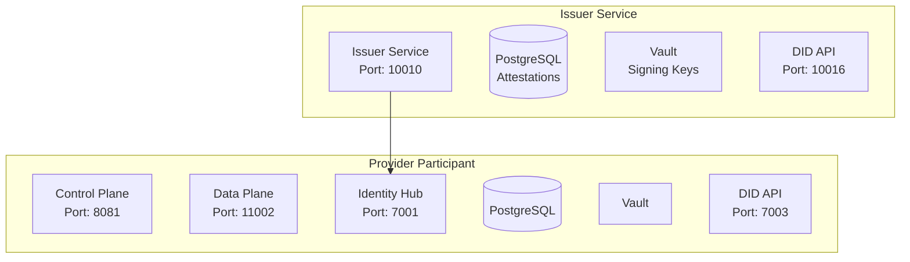

# Eclipse EDC Minimum Viable Dataspace

A complete deployment system for Eclipse EDC (Eclipse Dataspace Connector) participants with integrated identity management, credential issuance, and policy enforcement.

## Overview

This repository provides production-ready deployments for:

- **Provider Participant**: Data provider with Control Plane, Data Plane, and Identity Hub
- **Issuer Service**: Verifiable credential issuance and attestation management
- **Complete Dataspace Foundation**: Core components for data sharing with policy enforcement

### Key Features

- **Identity & Trust**: DID-based identity with verifiable credentials
- **Policy Enforcement**: Credential-based access control policies
- **Secure Communication**: TLS/HTTPS with cryptographic signatures
- **Production Ready**: Comprehensive security, monitoring, and deployment automation
- **Developer Friendly**: Local development with debugging support

## Quick Start

### Prerequisites

- **Docker** 20.10+ and **Docker Compose** 2.x
- **Python** 3.8+ 
- **Task** (recommended): `brew install go-task/tap/go-task`

### 1. Setup Environment

```bash
# Clone repository
git clone <repository-url>
cd <repository-name>

# Copy environment template
cp .env.example .env
# Edit .env with your configuration
```

### 2. Deploy Complete Dataspace

```bash
# Deploy Issuer Service (credential authority)
task issuer:deploy

# Deploy Provider Participant  
task provider:deploy

# Deploy both services together
task deploy:all
```

### 3. Test Data Exchange

```bash
# Test provider components
task provider:test

# Manual verification
curl -H "X-Api-Key: password" http://localhost:8081/management/v3/assets
```

## Architecture



## Configuration

### Environment Variables

Key configuration in `.env`:

```bash
# Provider Identity
PROVIDER_PUBLIC_HOST=host.docker.internal
PROVIDER_PARTICIPANT_NAME=provider

# Issuer Service
ISSUER_PUBLIC_HOST=host.docker.internal
ISSUER_DID=did:web:host.docker.internal%3A9876

# Security (⚠️ CHANGE FOR PRODUCTION!)
PROVIDER_MANAGEMENT_API_KEY=password
ISSUER_SUPERUSER_KEY=c3VwZXItdXNlcg==.c3VwZXItc2VjcmV0LWtleQo=
```

### Port Allocation

| Service      | Component      | Port  | Purpose               |
| ------------ | -------------- | ----- | --------------------- |
| **Issuer**   | Main API       | 10010 | Health, status        |
|              | Admin API      | 10013 | Credential management |
|              | DID API        | 10016 | DID document          |
| **Provider** | Management API | 8081  | Asset management      |
|              | DSP Protocol   | 8082  | Inter-connector       |
|              | Public API     | 11002 | Data access           |
|              | Identity Hub   | 7001  | Credentials           |
|              | DID API        | 7003  | DID document          |


## Deployment Components

### Issuer Service

Issues verifiable credentials for dataspace participants.

```bash
# Deploy Issuer
task issuer:up
task issuer:seed    # Create credential definitions
task issuer:verify

# Key endpoints
curl http://localhost:10010/api/check/health
curl http://localhost:9876/.well-known/did.json
```

**Credential Types:**
- **MembershipCredential**: Proves dataspace membership
- **DataProcessorCredential**: Attests data processing capabilities

### Provider Participant

Provides data assets with policy enforcement.

```bash
# Deploy Provider
task provider:up
task provider:seed    # Create sample assets
task provider:verify

# Key endpoints
curl -H "X-Api-Key: password" http://localhost:8081/management/v3/assets
curl http://localhost:7003/.well-known/did.json
```

**Components:**
- **Control Plane**: Asset and contract management
- **Data Plane**: Secure data transfer
- **Identity Hub**: Credential storage and validation

## API Reference

### Management API

**Authentication**: API Key (`X-Api-Key` header)

```bash
# List assets
curl -H "X-Api-Key: password" http://localhost:8081/management/v3/assets

# Create asset
curl -X POST -H "X-Api-Key: password" -H "Content-Type: application/json" \
  http://localhost:8081/management/v3/assets \
  -d '{
    "@id": "sample-asset",
    "properties": {"description": "Sample data"},
    "dataAddress": {"type": "HttpData", "baseUrl": "https://api.example.com/data"}
  }'

# List policies
curl -H "X-Api-Key: password" http://localhost:8081/management/v3/policydefinitions

# List contracts
curl -H "X-Api-Key: password" http://localhost:8081/management/v3/contractdefinitions
```

### Identity Hub API

**Authentication**: API Key (`X-Api-Key` header)

```bash
# List credentials
curl -H "X-Api-Key: password" \
  "http://localhost:7001/api/identity/v1alpha/participants/did:web:host.docker.internal%3A7003:provider/credentials"

# Request token
curl -X POST http://localhost:7002/api/sts/token \
  -H "Content-Type: application/json" \
  -d '{"audience": "did:web:consumer.example.com", "scope": "read"}'
```

### Issuer Admin API

**Authentication**: Superuser Key (`X-Api-Key` header)

```bash
# List participants
curl -H "X-Api-Key: c3VwZXItdXNlcg==.c3VwZXItc2VjcmV0LWtleQo=" \
  "http://localhost:10013/api/admin/v1alpha/participants/did:web:host.docker.internal%3A9876/holders"

# List credential definitions
curl -H "X-Api-Key: c3VwZXItdXNlcg==.c3VwZXItc2VjcmV0LWtleQo=" \
  "http://localhost:10013/api/admin/v1alpha/participants/did:web:host.docker.internal%3A9876/credentialdefinitions"
```

## Security

### Production Security Checklist

**⚠️ CRITICAL: Change all default credentials before production!**

- [ ] **API Keys**: Generate strong random keys
  ```bash
  PROVIDER_MANAGEMENT_API_KEY=$(openssl rand -base64 32)
  ISSUER_SUPERUSER_KEY=$(echo -n "admin" | base64).$(openssl rand -base64 24)
  ```

- [ ] **Database Passwords**: Use strong passwords
  ```bash
  PROVIDER_DB_PASSWORD=$(openssl rand -base64 24)
  ISSUER_DB_PASSWORD=$(openssl rand -base64 24)
  ```

- [ ] **Vault Tokens**: Never use `root` in production
- [ ] **TLS/HTTPS**: Enable for production
  ```bash
  EDC_IAM_DID_WEB_USE_HTTPS=true
  ```

- [ ] **Network Security**: Restrict port access, use VPN for management
- [ ] **Key Management**: Use HSM for production keys
- [ ] **Monitoring**: Enable audit logging and monitoring

### Authentication Methods

1. **API Key Authentication**: Management and Catalog APIs
2. **Bearer Token Authentication**: DSP Protocol and Public APIs  
3. **Credential-Based Authorization**: Policy enforcement using verifiable credentials

## Troubleshooting

### Quick Diagnostics

```bash
# Check all service health
task health:all

# View all logs  
task issuer:logs
task provider:logs

# Check specific service
docker logs mvd-provider-controlplane
docker logs mvd-issuer-service

# Test connectivity
curl http://localhost:8081/api/check/health
curl http://localhost:10010/api/check/health
```

### Common Issues

**Service Won't Start:**
```bash
# Check port conflicts
netstat -tulpn | grep 8081

# Check Docker resources
docker system df
docker stats --no-stream

# Restart with fresh containers
task provider:restart
```

**Database Connection Failures:**
```bash
# Check PostgreSQL
docker logs mvd-provider-postgres
docker exec mvd-provider-postgres pg_isready

# Test connection
docker exec -it mvd-provider-postgres psql -U provider_cp -d provider_controlplane
```

**Authentication Failures:**
```bash
# Verify API key
grep MANAGEMENT_API_KEY .env

# Test with correct key
curl -H "X-Api-Key: $(grep PROVIDER_MANAGEMENT_API_KEY .env | cut -d= -f2)" \
  http://localhost:8081/management/v3/assets
```

**DID Resolution Failures:**
```bash
# Check DID API
curl http://localhost:7003/.well-known/did.json
docker logs mvd-provider-identityhub

# Verify DID format
python3 -c "
from urllib.parse import quote
print(f'DID: did:web:{quote(\"host.docker.internal:7003\", safe=\"\")}:provider')
"
```

### Log Analysis

```bash
# Search for errors
docker logs mvd-provider-controlplane 2>&1 | grep -i error

# Monitor in real-time
docker logs -f mvd-provider-controlplane | grep -E "(ERROR|WARN)"

# Export logs for analysis
mkdir logs-$(date +%Y%m%d_%H%M%S)
docker logs mvd-provider-controlplane > logs-*/controlplane.log
docker logs mvd-provider-dataplane > logs-*/dataplane.log
```

## Development

### Development Setup

```bash
# Enable debug mode
export PROVIDER_CP_DEBUG_PORT=1044
export PROVIDER_DP_DEBUG_PORT=1045
export PROVIDER_IH_DEBUG_PORT=1046

# Start with debugging
task provider:up

# Connect IDE debugger to localhost:1044 (Control Plane), 1043 (Issuer), 1045 (Data Plane), 1046 (Identity Hub)
```

### Building from Source

```bash
# Build EDC components and Docker images
task build

# Run provider tests
task provider:test

# Run individual component tests
task provider:test-controlplane
task provider:test-dataplane
task provider:test-identityhub
```

### Code Quality

```bash
# Format code
cd edc-mvds && ./gradlew spotlessApply
black scripts/ && isort scripts/

# Static analysis
./gradlew spotbugsMain
flake8 scripts/
```

## Production Deployment

### Environment-Specific Configuration

**Development:**
```bash
PROVIDER_PUBLIC_HOST=host.docker.internal
EDC_IAM_DID_WEB_USE_HTTPS=false
EDC_LOG_LEVEL=DEBUG
```

**Production:**
```bash
PROVIDER_PUBLIC_HOST=provider.yourdomain.com
EDC_IAM_DID_WEB_USE_HTTPS=true
EDC_LOG_LEVEL=WARN
# Strong authentication credentials
```

### Monitoring and Backup

```bash
# Health monitoring
while true; do
  curl -f http://localhost:8081/api/check/health || echo "$(date): Health check failed"
  sleep 60
done

# Check health of all services
task health:all

# Configuration backup
cp -r config config-backup-$(date +%Y%m%d)
```

## Task Commands

### Issuer Service
```bash
task issuer:up          # Start services
task issuer:seed        # Create credentials
task issuer:verify      # Verify deployment
task issuer:logs        # View logs
task issuer:down        # Stop services
```

### Provider Participant
```bash
task provider:up        # Start services
task provider:seed      # Create sample data
task provider:verify    # Verify deployment
task provider:logs      # View logs
task provider:down      # Stop services
```


### System-wide
```bash
task deploy:all         # Deploy both Issuer and Provider
task status:all         # Check status of all services
task health:all         # Check health of all services
task clean:all          # Clean everything
```

## Support

### Getting Help

1. **Documentation**: Check troubleshooting section above
2. **Logs**: Collect logs using `task issuer:logs` and `task provider:logs`
3. **GitHub Issues**: Search existing issues or create new one
4. **Community**: EDC community forums and discussions

### Issue Reporting

Include in your issue report:
- Environment details (OS, Docker version)
- Steps to reproduce
- Complete error logs (`task issuer:logs` and `task provider:logs`)
- Configuration (sanitized)

This deployment system provides a complete, production-ready Eclipse EDC dataspace with integrated identity management and credential-based policy enforcement.