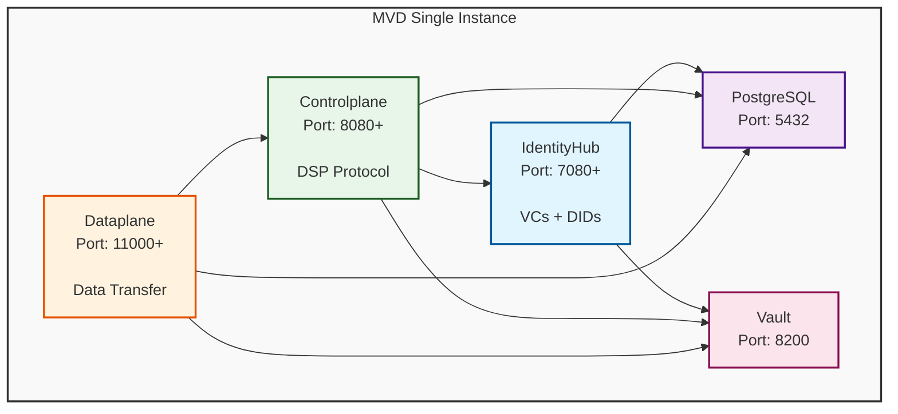

# EDC MVD Single-Instance Deployment

Docker Compose deployment of the Eclipse Dataspace Components (EDC) Minimum Viable Dataspace, designed for development, testing, and single-participant dataspace scenarios.

## Quick Start

```bash
# Build and start (first time - auto-clones MVD repository)
task build && task up && task seed

# Verify everything works
task health
curl http://localhost:7083/.well-known/did.json
```

Done! Your dataspace participant is running.

## Prerequisites

- Docker & Docker Compose v2.0+
- [Task](https://taskfile.dev/installation/) (task runner)
- Git, curl, jq

## Architecture



**Components:**
- **IdentityHub** (7080+): Manages Verifiable Credentials and DIDs
- **Controlplane** (8080+): Orchestrates contract negotiations via DSP protocol
- **Dataplane** (11000+): Handles actual data transfers
- **PostgreSQL** (5432): Persistent storage for all components
- **Vault** (8200): Secure secret management

## Essential Commands

```bash
# Setup & Build
task setup          # Manually clone/update MVD source (auto-run on build)
task build          # Build Docker images from source

# Lifecycle
task up             # Start all services
task down           # Stop all services
task restart        # Restart services
task clean          # Remove all data and volumes

# Monitoring
task status         # Container status
task health         # Health check all services
task logs           # Tail logs (all services)
task logs-service SERVICE=controlplane  # Logs for specific service

# Data Management
task seed           # Initialize with participant and test data
task backup         # Backup PostgreSQL
task restore BACKUP=file.sql  # Restore from backup

# Development
task db             # Connect to PostgreSQL
task vault          # Check Vault status
task shell SERVICE=identityhub  # Shell into container
```

## Source Repository Management

The deployment automatically manages the [EDC MVD repository](https://github.com/eclipse-edc/MinimumViableDataspace):
- Auto-clones to `./edc-mvds` on first build
- Configurable via `Taskfile.yml` variables:
  - `MVD_REF`: Branch or commit (default: `69e4b0b`)
  - `MVD_REPO_URL`: Repository URL

```bash
# Check source status
task setup-source   # Updates to configured ref
```

To use a different version, edit `Taskfile.yml`:
```yaml
vars:
  MVD_REF: main  # or 'release/0.14.0', or a commit hash
```

## Configuration

### Service Endpoints

| Service          | Endpoint                                     | Auth                  | Purpose                 |
| ---------------- | -------------------------------------------- | --------------------- | ----------------------- |
| Management API   | `http://localhost:8081/api/management`       | `x-api-key: password` | Manage assets, policies |
| DSP Protocol     | `http://localhost:8082/api/dsp`              | DCP credentials       | Connector communication |
| Catalog API      | `http://localhost:8084/api/catalog`          | `x-api-key: password` | Query catalog           |
| DID Document     | `http://localhost:7083/.well-known/did.json` | Public                | Identity verification   |
| IdentityHub API  | `http://localhost:7080/api`                  | -                     | Credential management   |
| Dataplane Public | `http://localhost:11001/api/public`          | Token                 | Data access             |

### Environment Files

Configure services via `config/`:
- `identityhub.env` - IdentityHub settings
- `controlplane.env` - Controlplane settings
- `dataplane.env` - Dataplane settings

### Default Credentials (CHANGE FOR PRODUCTION!)

- Management API Key: `password`
- Vault Token: `root-token`
- PostgreSQL: `mvd_user` / `mvd_password` / `mvd` database

## Working with the Dataspace

### List Assets

```bash
curl http://localhost:8081/api/management/v3/assets \
  -H 'x-api-key: password' | jq
```

### Create an Asset

```bash
curl -X POST http://localhost:8081/api/management/v3/assets \
  -H 'x-api-key: password' \
  -H 'Content-Type: application/json' \
  -d '{
    "@context": {"@vocab": "https://w3id.org/edc/v0.0.1/ns/"},
    "@id": "my-asset",
    "properties": {
      "name": "My Dataset",
      "contenttype": "application/json"
    },
    "dataAddress": {
      "@type": "DataAddress",
      "type": "HttpData",
      "baseUrl": "https://example.com/data"
    }
  }'
```

### Query Catalog

```bash
curl http://localhost:8084/api/catalog \
  -H 'x-api-key: password' | jq
```

## Connecting to Other Participants

### 1. Exchange DIDs

Your DID: `did:web:identityhub%3A7083`

Share your DID document URL: `http://localhost:7083/.well-known/did.json`

**Production Note**: DIDs must be publicly resolvable (e.g., `did:web:connector.example.com`)

### 2. Add Participants

Edit `assets/participants/participants.json`:

```json
{
  "mvd-participant": "did:web:identityhub%3A7083",
  "partner-company": "did:web:partner.example.com"
}
```

### 3. Verify Credentials

This deployment requires:
- **MembershipCredential**: Dataspace membership (required for all DSP requests)
- **DataProcessorCredential**: Data processing capability (`processing` or `sensitive` level)

Credentials are in `assets/credentials/` and auto-loaded on seed.

## Development Workflow

### Remote Debugging

Java remote debugging enabled:
- IdentityHub: `localhost:1044`
- Controlplane: `localhost:1045`
- Dataplane: `localhost:1046`

Configure your IDE debugger to attach to these ports.

### Modify Source Code

```bash
# 1. Edit source in ./edc-mvds
cd ./edc-mvds
# Make changes...

# 2. Rebuild and restart
cd ..
task rebuild

# 3. Re-seed if needed
task seed
```

### Database Inspection

```bash
task db  # Opens psql

# Useful queries:
\dt                                    # List tables
SELECT * FROM edc_asset;               # View assets
SELECT * FROM edc_contract_definition; # View contracts
SELECT * FROM edc_transfer_process;    # View transfers
```

## Data Persistence

### Volumes

- `postgres-data`: PostgreSQL data (Docker-managed volume)
- Vault runs in **dev mode** (in-memory, NOT persisted)

### Backup & Restore

```bash
# Backup
task backup  # Creates ./backups/mvd-backup-YYYYMMDD-HHMMSS.sql

# Restore
task restore BACKUP=./backups/mvd-backup-20241021-123456.sql
```

## Troubleshooting

### Services Won't Start

```bash
# Check logs
task logs

# Check Docker
docker ps

# Clean restart
task down
task up
```

### Seeding Fails

```bash
# Wait for services to fully initialize
sleep 30
task seed

# Check IdentityHub health
curl http://localhost:7080/api/check/health
```

### Port Conflicts

If ports are in use:
1. Stop conflicting services: `sudo lsof -i :8080`
2. Or edit `compose.yaml` to use different ports

### Database Connection Issues

```bash
# Reset database
task down
docker volume rm eifede-mvds_postgres-data
task up
sleep 30
task seed
```

### Cannot Resolve DID

```bash
# Check IdentityHub is running
curl http://localhost:7083/.well-known/did.json

# Verify service health
task health
```

## Production Deployment

**This deployment is for development/testing.** For production, implement:

- [ ] **TLS/HTTPS**: All endpoints must use HTTPS
- [ ] **Managed Database**: Use PostgreSQL service with replication
- [ ] **Production Vault**: Configure Vault cluster with persistent storage
- [ ] **Secret Management**: Rotate all API keys and tokens
- [ ] **Public DIDs**: Ensure DIDs are publicly resolvable
- [ ] **Network Security**: Configure firewalls, VPNs
- [ ] **Monitoring**: Add metrics, logging, alerting
- [ ] **Automated Backups**: Schedule regular backups
- [ ] **Resource Limits**: Set CPU/memory constraints
- [ ] **Load Balancing**: Add multiple dataplane instances

## Project Structure

```
eifede-mvds/
├── compose.yaml              # Docker Compose configuration
├── Taskfile.yml             # Task automation
├── config/                  # Service configurations
│   ├── identityhub.env
│   ├── controlplane.env
│   └── dataplane.env
├── assets/                  # Static assets
│   ├── credentials/         # Pre-seeded Verifiable Credentials
│   ├── keys/               # Cryptographic keys
│   └── participants/       # Participant list
├── scripts/                # Helper scripts
│   ├── setup-mvd-source.sh # Clone/update MVD repo
│   ├── seed.sh            # Initialize dataspace
│   └── init-db.sql        # Database setup
├── edc-mvds/              # MVD source (auto-cloned, gitignored)
└── backups/               # Database backups (gitignored)
```

## Resources

- [Eclipse Dataspace Components](https://github.com/eclipse-edc/Connector)
- [EDC MVD Source](https://github.com/eclipse-edc/MinimumViableDataspace)
- [EDC Documentation](https://eclipse-edc.github.io/docs/)
- [Dataspace Protocol](https://docs.internationaldataspaces.org/)

## License

Apache License 2.0
