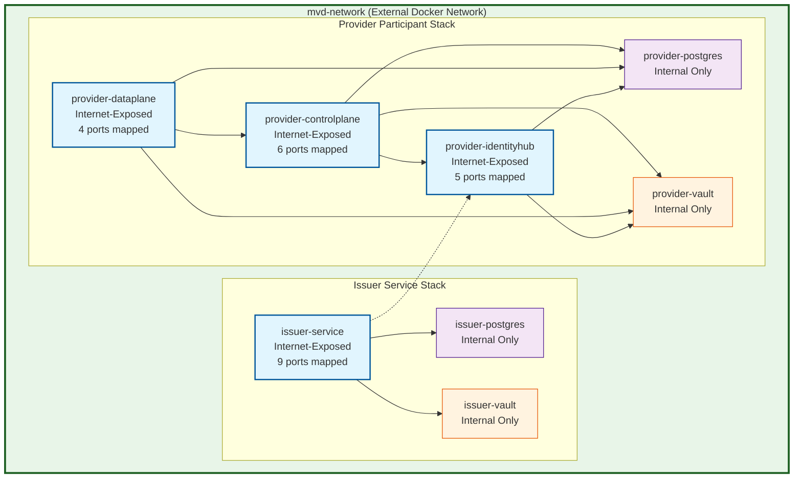
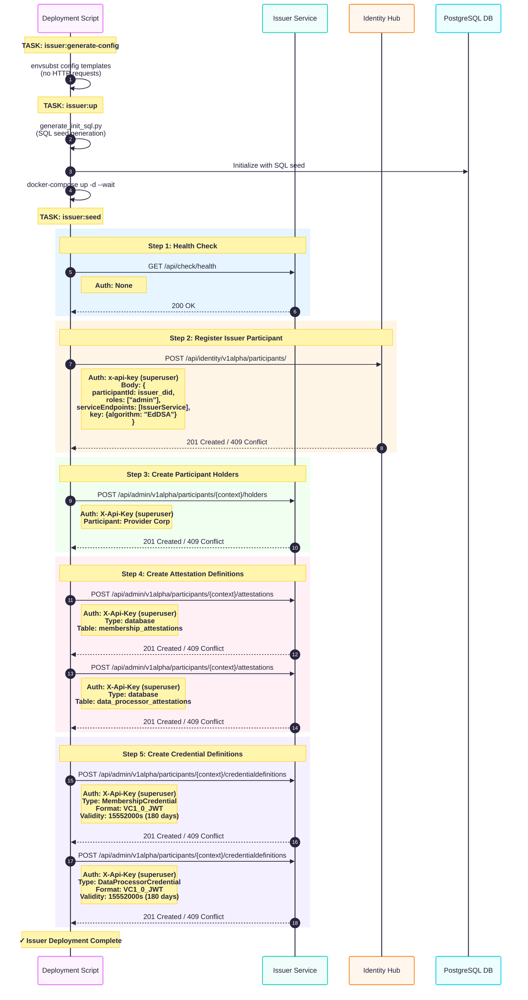
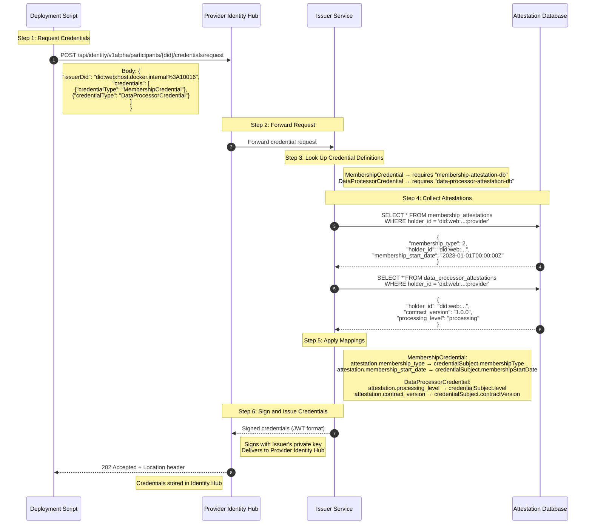

# EDC MVD Dataspace Kit

A parameterized deployment toolkit for Eclipse EDC dataspaces, evolved from the [original Eclipse Dataspace Components (EDC) MVD](https://github.com/eclipse-edc/MinimumViableDataspace). Built with Docker Compose for simplified deployment, this kit enables configuration of dataspace participants and supports both local development and internet-exposed production environments.

## Overview

This repository provides deployments for:

- **Provider Participant**: Data provider with Control Plane, Data Plane, and Identity Hub
- **Issuer Service**: Verifiable credential issuance and attestation management

## Quick Start

### Prerequisites

- **Docker** 20.10+ and **Docker Compose** 2.x
- **Python** 3.8+ with pip
- **Task** (recommended): `brew install go-task/tap/go-task`

### 1. Setup Environment

```bash
# Clone repository
git clone <repository-url>
cd <repository-name>

# Install Python dependencies
pip3 install -r requirements.txt

# Copy environment template
cp .env.example .env
# Edit .env with your configuration
```

### 2. Deploy Complete Dataspace

**Important**: Follow this order for initial deployment:

```bash
# Step 1: Build Docker images (required first time and after source updates)
task build

# Step 2: Deploy Issuer Service (credential authority)
# This must be deployed BEFORE the provider
task issuer:deploy

# Step 3: Deploy Provider Participant
# Depends on Issuer being available for credential requests
task provider:deploy
```

> **Note**: The Issuer Service must be running before deploying the Provider, as the Provider requests credentials during deployment.

## Deployment Scenarios

This codebase supports flexible deployment configurations to align with dataspace principles, where participants can share infrastructure or deploy independently.

### Scenario A: Full Local Deployment (Default)

**Use Case**: Local development, testing, and self-contained demos

**Description**: Deploy both Issuer and Provider services locally using Docker Compose.

```bash
# 1. Configure .env
cp .env.example .env
# Keep default: DEPLOY_ISSUER=true
# Keep default: ISSUER_PUBLIC_HOST=host.docker.internal

# 2. Build Docker images
task build

# 3. Deploy Issuer Service
task issuer:deploy

# 4. Deploy Provider Participant
task provider:deploy
```

**Result**: Both services run locally, Issuer issues credentials to Provider.

---

### Scenario B: Provider with External Issuer (Production)

Deploy Provider only, connect to external Issuer Service.

**Configuration**:
```bash
cp .env.example .env
# Edit .env:
DEPLOY_ISSUER=false
ISSUER_PUBLIC_HOST=issuer.dataspace.example.com
ISSUER_SUPERUSER_KEY=<credentials-from-issuer-admin>
```

**Deployment**:
```bash
task build
task provider:deploy
```

---

### Scenario C: Issuer Only (Infrastructure Providers)

Deploy Issuer Service for multiple participants.

```bash
cp .env.example .env
# Set: ISSUER_PUBLIC_HOST=issuer.dataspace.example.com
task build
task issuer:deploy
# Expose ports: 10010, 10012, 10013, 10016
```

### Deployment Scenarios

| Scenario               | Components        | Use Case                 | Network              |
| ---------------------- | ----------------- | ------------------------ | -------------------- |
| **A: Complete Local**  | Issuer + Provider | Development/Testing      | Local only           |
| **B: External Issuer** | Provider only     | Production participants  | Remote Issuer access |
| **C: Issuer Only**     | Issuer only       | Infrastructure providers | Public accessibility |

---

## Architecture



## Configuration

### Environment Variables

Key configuration is stored in `.env` (example default configuration is available in `.env.example`).

### Configurable Data Sources

The Provider can expose any number of data assets to the dataspace. Configure assets using environment variables:

**Required per asset:**
- `PROVIDER_ASSET_{N}_ID` - Unique asset identifier
- `PROVIDER_ASSET_{N}_BASE_URL` - Data source URL

**Optional per asset:**
- `PROVIDER_ASSET_{N}_DESCRIPTION` - Human-readable description
- `PROVIDER_ASSET_{N}_PROXY_PATH` - Enable path proxying (default: "true")
- `PROVIDER_ASSET_{N}_PROXY_QUERY_PARAMS` - Enable query parameter proxying (default: "true")
- `PROVIDER_ASSET_{N}_PROPERTY_{NAME}` - Custom asset properties
- `PROVIDER_ASSET_{N}_DATA_{NAME}` - Custom data address properties

**Examples:**
```bash
# Basic API asset
PROVIDER_ASSET_1_ID=todos-api
PROVIDER_ASSET_1_BASE_URL=https://jsonplaceholder.typicode.com/todos

# Database with custom properties
PROVIDER_ASSET_2_ID=customer-data
PROVIDER_ASSET_2_BASE_URL=https://api.example.com/customers
PROVIDER_ASSET_2_PROPERTY_CATEGORY=customer-data
PROVIDER_ASSET_2_DATA_AUTHHEADER=Bearer
```

## Deployment Components

### Issuer Service

Issues verifiable credentials for dataspace participants.

**Credential Types:**
- **MembershipCredential**: Proves dataspace membership
- **DataProcessorCredential**: Attests to data processing capabilities

### Provider Participant

Provides data assets with policy enforcement.

**Components:**
- **Control Plane**: Asset and contract management
- **Data Plane**: Secure data transfer
- **Identity Hub**: Credential storage and validation

## Deployment Sequence

### Issuer



### Provider

```mermaid
sequenceDiagram
  participant Script as Deployment Script
  participant CP as Control Plane
  participant DP as Data Plane
  participant IH as Provider Identity Hub
  participant Vault as Vault
  participant Issuer as Issuer Service
  autonumber
  Note over Script: TASK: provider:up
  rect rgb(250, 250, 250)
    Note over Script: Dependency: build
    Script ->> Script: ./gradlew clean build
    Script ->> Script: ./gradlew dockerize
  end
  rect rgb(245, 250, 255)
    Note over Script: Dependency: provider:configure
    Script ->> Script: provider:generate-config (envsubst)
    Script ->> Script: provider:validate-config
    Script ->> Script: configure_controlplane.py
    Script ->> Script: configure_dataplane.py
    Script ->> Script: configure_identityhub.py
  end
  Script ->> Script: docker-compose up -d --wait
  Note over Script: TASK: provider:seed
  rect rgb(230, 245, 255)
    Note over Script, CP: Step 1: Health Check
    Script ->> CP: GET /api/check/health
    Note right of Script: Auth: None
    CP -->> Script: 200 OK
  end
  rect rgb(255, 245, 230)
    Note over Script, IH: Step 2: Register Provider Participant
    Script ->> IH: POST /api/identity/v1alpha/participants/
    Note right of Script: Auth: x-api-key (superuser)<br/>participantId: provider_did<br/>roles: []<br/>serviceEndpoints: CredentialService + ProtocolEndpoint<br/>key.algorithm: EC
    IH -->> Script: 201 Created + clientSecret
    Note left of IH: Returns STS client secret
  end
  rect rgb(255, 250, 240)
    Note over Script, Vault: Step 3: Store STS Client Secret
    Script ->> CP: POST /api/management/v3/secrets
    Note right of Script: Auth: x-api-key (management)<br/>@id: provider-sts-client-secret<br/>value: clientSecret from Step 2
    CP ->> Vault: Store secret in Vault
    CP -->> Script: 201 Created / 409 Conflict
  end
  rect rgb(240, 255, 240)
    Note over Script, CP: Step 4: Create Data Assets
    Script ->> CP: POST /api/management/v3/assets
    Note right of Script: Auth: x-api-key (management)<br/>@id: asset-1<br/>type: HttpData<br/>baseUrl: jsonplaceholder
    CP -->> Script: 200 OK / 409 Conflict
    Script ->> CP: POST /api/management/v3/assets
    Note right of Script: Auth: x-api-key (management)<br/>@id: asset-2<br/>type: HttpData<br/>baseUrl: jsonplaceholder
    CP -->> Script: 200 OK / 409 Conflict
  end
  rect rgb(255, 240, 245)
    Note over Script, CP: Step 5: Create Policy Definitions
    Script ->> CP: POST /api/management/v3/policydefinitions
    Note right of Script: Auth: x-api-key (management)<br/>@id: allow-all<br/>permission.action: use
    CP -->> Script: 200 OK / 409 Conflict
    Script ->> CP: POST /api/management/v3/policydefinitions
    Note right of Script: Auth: x-api-key (management)<br/>@id: require-membership<br/>constraint: MembershipCredential eq active
    CP -->> Script: 200 OK / 409 Conflict
    Script ->> CP: POST /api/management/v3/policydefinitions
    Note right of Script: Auth: x-api-key (management)<br/>@id: require-dataprocessor<br/>constraint: DataAccess.level eq processing
    CP -->> Script: 200 OK / 409 Conflict
    Script ->> CP: POST /api/management/v3/policydefinitions
    Note right of Script: Auth: x-api-key (management)<br/>@id: require-sensitive<br/>constraint: DataAccess.level eq sensitive
    CP -->> Script: 200 OK / 409 Conflict
  end
  rect rgb(245, 240, 255)
    Note over Script, CP: Step 6: Create Contract Definitions
    Script ->> CP: POST /api/management/v3/contractdefinitions
    Note right of Script: Auth: x-api-key (management)<br/>@id: simple-access-def<br/>accessPolicyId: allow-all<br/>contractPolicyId: allow-all<br/>assetSelector: asset-1
    CP -->> Script: 200 OK / 409 Conflict
    Script ->> CP: POST /api/management/v3/contractdefinitions
    Note right of Script: Auth: x-api-key (management)<br/>@id: sensitive-only-def<br/>accessPolicyId: require-membership<br/>contractPolicyId: require-sensitive<br/>assetSelector: asset-2
    CP -->> Script: 200 OK / 409 Conflict
  end
  rect rgb(250, 245, 245)
    Note over Script, CP: Step 7: Verify Seeded Data
    Script ->> CP: POST /api/management/v3/assets/request
    Note right of Script: Auth: x-api-key (management)<br/>body: QuerySpec
    CP -->> Script: 200 OK (array of assets)
    Script ->> CP: POST /api/management/v3/policydefinitions/request
    Note right of Script: Auth: x-api-key (management)<br/>body: QuerySpec
    CP -->> Script: 200 OK (array of policies)
    Script ->> CP: POST /api/management/v3/contractdefinitions/request
    Note right of Script: Auth: x-api-key (management)<br/>body: QuerySpec
    CP -->> Script: 200 OK (array of contracts)
  end
  Note over Script: TASK: provider:request-credentials
  rect rgb(240, 245, 255)
    Note over Script, Issuer: Step 8: Request Verifiable Credentials
    Script ->> IH: POST /api/identity/v1alpha/participants/{base64_did}/credentials/request
    Note right of Script: Auth: x-api-key (superuser)<br/>issuerDid: issuer_did<br/>credentials: MembershipCredential + DataProcessorCredential
    IH ->> Issuer: Forward credential request
    IH -->> Script: 202 Accepted<br/>Location header with status URL
  end
  rect rgb(230, 240, 255)
    Note over Script, IH: Step 9: Poll Credential Status
    loop Poll until ISSUED (max 30 attempts)
      Script ->> IH: GET /api/identity{location_path}
      Note right of Script: Auth: x-api-key (superuser)
      IH -->> Script: 200 OK (status: PENDING)
    end
    Script ->> IH: GET /api/identity{location_path}
    Note right of Script: Auth: x-api-key (superuser)
    IH -->> Script: 200 OK (status: ISSUED)
    Note left of IH: Credentials stored<br/>in Identity Hub
  end
  Note over Script: ✓ Provider Deployment Complete
```



## FAQs

### How does the Provider interact with the Issuer Service during credential requests?

The Provider deployment script **never directly contacts the Issuer Service**. Instead, the architecture follows this pattern:

1. **Deployment Script → Provider Identity Hub**: The deployment script sends credential requests to the Provider's own Identity Hub using the Provider's superuser token (see Step 8 in the Provider sequence diagram at line 360).

2. **Identity Hub → Issuer Service**: The Provider's Identity Hub then forwards the credential request to the configured Issuer Service (see the "IH ->> Issuer: Forward credential request" arrow in the sequence diagram).

3. **Credential Delivery**: The Issuer Service processes the request and delivers credentials back to the Provider's Identity Hub, where they are stored.

**Where is the Issuer configured?**

The Issuer that the Identity Hub should use is configured in two places:

1. **Credential Request Parameter**: When the deployment script requests credentials, it explicitly specifies which issuer to use via the `issuerDid` parameter:
   - **File**: `scripts/provider/request_credentials.py:198`
   - The `issuerDid` is constructed from the `ISSUER_PUBLIC_HOST` and `ISSUER_DID_API_PORT` environment variables

2. **Trusted Issuers Configuration**: The Identity Hub and Control Plane must be configured to trust specific issuers:
   - **File**: `config/trusted-issuers.properties.template:12`
   - **Configuration**: `edc.iam.trusted-issuer.demoissuer.id=did:web:${ISSUER_PUBLIC_HOST}%3A${ISSUER_DID_API_PORT}`
   - This tells the Provider which issuers to trust for credential verification

**Key Environment Variables**:
- `ISSUER_PUBLIC_HOST`: The public hostname/DNS of the Issuer Service
- `ISSUER_DID_API_PORT`: The port where the Issuer's DID document is served (default: 10016)

This architecture allows the Provider to operate independently while delegating credential issuance to a trusted external authority, following the separation of concerns principle in dataspace architectures.

### What are Attestations and Credential Definitions, and how do they work together?

Understanding these two concepts is key to understanding how the Issuer Service issues verifiable credentials:

#### **Attestations: The Source of Truth**

**What they are:**
Attestations are **trusted sources of claims** about a participant. Think of them as "pre-verified evidence" that the Issuer can reference when creating credentials.

**Real-world analogy:**
- When you apply for a driver's license, the DMV checks their database to verify you passed your driving test
- That database record is an attestation: a trusted source confirming "this person passed on this date"

**In this codebase:**
Attestations are database tables that store verified information about participants:

1. **`membership_attestations` table** (`deployment/issuer/init-issuer-db.sql.template:32`)
   - Stores: participant DID, membership type, start date
   - Example: "Provider X joined the dataspace on 2023-01-01 as a Provider member"

2. **`data_processor_attestations` table** (`deployment/issuer/init-issuer-db.sql.template:41`)
   - Stores: participant DID, contract version, processing level
   - Example: "Provider X is authorized for 'processing' level data access under contract v1.0.0"

**How attestations are configured:**
Each attestation needs an **Attestation Definition** that tells the Issuer how to retrieve the data (`scripts/issuer/create_attestations.py`):

```python
# Attestation Definition for Membership
{
    "id": "membership-attestation-db",
    "attestationType": "database",
    "configuration": {
        "tableName": "membership_attestations",
        "dataSourceName": "issuer-datasource",
        "idColumn": "holder_id"  # Match by participant DID
    }
}
```

This says: "To get membership attestations, query the `membership_attestations` table where `holder_id` matches the participant's DID."

#### **Credential Definitions: The Recipe for Credentials**

**What they are:**
Credential Definitions are **blueprints** that specify:
- What type of credential to issue (e.g., "MembershipCredential")
- Which attestations are required as input
- How to transform attestation data into credential claims
- How long the credential remains valid

**Real-world analogy:**
- A driver's license template that says: "To issue this license, check the driving test database (attestation), verify the person passed (rule), and print their name and test date on the license (mapping)"

**In this codebase:**
Two credential definitions are created (`scripts/issuer/create_credentials.py`):

1. **MembershipCredential** (`scripts/issuer/create_credentials.py:74`)
   ```python
   {
       "id": "membership-credential-def",
       "credentialType": "MembershipCredential",
       "attestations": ["membership-attestation-db"],  # Requires membership data
       "mappings": [
           # Transform attestation data into credential claims
           {"input": "membership_type", "output": "credentialSubject.membershipType"},
           {"input": "membership_start_date", "output": "credentialSubject.membershipStartDate"},
           {"input": "holder_id", "output": "credentialSubject.id"}
       ],
       "format": "VC1_0_JWT",
       "validity": 15552000  # 180 days in seconds
   }
   ```

2. **DataProcessorCredential** (`scripts/issuer/create_credentials.py:98`)
   - Similar structure, but uses `data_processor_attestations`
   - Maps processing level and contract version into the credential

#### **How They Work Together: The Complete Flow**

Here's what happens when the Provider requests credentials during deployment:



#### **Key Takeaways**

1. **Separation of Concerns:**
   - **Attestations** = "What we know to be true" (the data)
   - **Credential Definitions** = "How to package that truth into a credential" (the template)

2. **Flexibility:**
   - The same attestation can be used by multiple credential definitions
   - You can add new credential types without changing attestation data
   - Attestations can come from different sources (database, APIs, other credentials)

3. **Trust Model:**
   - Attestations are controlled by the Issuer (stored in Issuer's database)
   - Only the Issuer can modify attestation data
   - Participants trust the Issuer to maintain accurate attestations

4. **In This Codebase:**
   - Attestation tables are seeded during Issuer deployment: `deployment/issuer/init-issuer-db.sql.template`
   - Attestation Definitions are created: `scripts/issuer/create_attestations.py`
   - Credential Definitions are created: `scripts/issuer/create_credentials.py`
   - Credentials are requested: `scripts/provider/request_credentials.py`

5. **Extensibility:**
   - Beyond database attestations, EDC supports "presentation attestations" (require another credential as proof)
   - Custom attestation types can be implemented (e.g., query external APIs, blockchain, etc.)