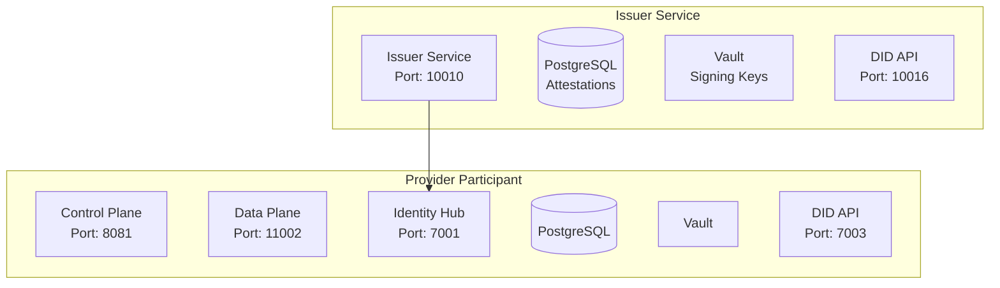

# Eclipse EDC Minimum Viable Dataspace

A complete deployment system for Eclipse EDC (Eclipse Dataspace Connector) participants with integrated identity management, credential issuance, and policy enforcement.

## Overview

This repository provides production-ready deployments for:

- **Provider Participant**: Data provider with Control Plane, Data Plane, and Identity Hub
- **Issuer Service**: Verifiable credential issuance and attestation management
- **Complete Dataspace Foundation**: Core components for data sharing with policy enforcement

### Key Features

- **Identity & Trust**: DID-based identity with verifiable credentials
- **Policy Enforcement**: Credential-based access control policies
- **Secure Communication**: TLS/HTTPS with cryptographic signatures
- **Production Ready**: Comprehensive security, monitoring, and deployment automation
- **Developer Friendly**: Local development with debugging support

## Quick Start

### Prerequisites

- **Docker** 20.10+ and **Docker Compose** 2.x
- **Python** 3.8+ with pip
- **Task** (recommended): `brew install go-task/tap/go-task`
- **envsubst** (usually pre-installed on macOS/Linux)

### 1. Setup Environment

```bash
# Clone repository
git clone <repository-url>
cd <repository-name>

# Install Python dependencies
pip3 install -r requirements.txt

# Copy environment template
cp .env.example .env
# Edit .env with your configuration
```

### 2. Deploy Complete Dataspace

**Important**: Follow this order for initial deployment:

1. **First time only**: Build Docker images
2. Deploy Issuer Service
3. Deploy Provider Participant

```bash
# Step 1: Build Docker images (required first time and after source updates)
task build

# Step 2: Deploy Issuer Service (credential authority)
# This must be deployed BEFORE the provider
task issuer:deploy

# Step 3: Deploy Provider Participant
# Depends on Issuer being available for credential requests
task provider:deploy
```

> **Note**: The Issuer Service must be running before deploying the Provider, as the Provider requests credentials during deployment.

### 3. Verify Deployment

```bash
# Check provider status
task provider:status

# Verify Management API
curl -H "X-Api-Key: password" http://localhost:8081/management/v3/assets

# Check Issuer status
task issuer:status

# Verify Issuer health
curl http://localhost:10010/api/check/health
```

### Common Operations

```bash
# View service status
task issuer:status
task provider:status

# View logs
docker compose -p mvds-issuer logs -f
docker compose -p mvds-provider logs -f

# Restart services
task provider:restart

# Stop services
task issuer:down
task provider:down

# Clean up (removes all data)
task issuer:clean
task provider:clean
```

## Architecture



## Configuration

### Environment Variables

Key configuration in `.env`:

```bash
# Provider Identity
PROVIDER_PUBLIC_HOST=host.docker.internal
PROVIDER_PARTICIPANT_NAME=provider

# Issuer Service
ISSUER_PUBLIC_HOST=host.docker.internal
# Note: ISSUER_DID is auto-generated from ISSUER_PUBLIC_HOST:ISSUER_DID_API_PORT

# Security (⚠️ CHANGE FOR PRODUCTION!)
PROVIDER_MANAGEMENT_API_KEY=password
ISSUER_SUPERUSER_KEY=c3VwZXItdXNlcg==.c3VwZXItc2VjcmV0LWtleQo=
```

### Port Allocation

| Service      | Component      | Port  | Purpose               |
| ------------ | -------------- | ----- | --------------------- |
| **Issuer**   | Main API       | 10010 | Health, status        |
|              | Admin API      | 10013 | Credential management |
|              | DID API        | 10016 | DID document          |
| **Provider** | Management API | 8081  | Asset management      |
|              | DSP Protocol   | 8082  | Inter-connector       |
|              | Public API     | 11002 | Data access           |
|              | Identity Hub   | 7001  | Credentials           |
|              | DID API        | 7003  | DID document          |

## Project Structure

```
eifede-mvds/
├── edc-mvds/                      # Cloned Eclipse EDC MinimumViableDataspace
│   └── (Gradle-based Java project)
├── scripts/                       # Python automation scripts
│   ├── issuer/                    # Issuer seeding and configuration
│   │   ├── seed_issuer.py        # Main orchestration
│   │   ├── create_credentials.py # Create credential definitions
│   │   └── ...
│   └── provider/                  # Provider setup and testing
│       ├── generate_config.py    # Generate component configs
│       ├── seed_participant.py   # Seed assets, policies, contracts
│       ├── request_credentials.py # Request creds from Issuer
│       └── test_*.py             # Component tests
├── config/                        # Generated runtime configuration
│   ├── issuer-service.env        # Generated from template
│   ├── provider-controlplane.env # Generated by scripts
│   └── ...
├── deployment/                    # Database initialization
│   ├── issuer/init-issuer-db.sql
│   └── provider/init-provider-db.sql
├── assets/                        # Runtime assets (generated)
│   ├── credentials/              # Verifiable credentials
│   ├── keys/                     # Cryptographic keys
│   └── participants/             # Participant definitions
├── docker-compose.issuer.yaml    # Issuer service compose file
├── docker-compose.provider.yaml  # Provider participant compose file
├── Taskfile.yml                  # Task automation definitions
├── .env.example                  # Environment variable template
└── requirements.txt              # Python dependencies
```

**Key Directories**:
- **edc-mvds/**: Source code for EDC components (auto-cloned by `task setup-source`)
- **scripts/**: All automation, seeding, and testing logic
- **config/**: Auto-generated configuration files (do not edit manually)
- **assets/**: Runtime-generated keys, credentials, and participant data

## Deployment Components

### Issuer Service

Issues verifiable credentials for dataspace participants.

```bash
# Deploy Issuer (complete deployment)
task issuer:deploy

# Or deploy step-by-step:
task issuer:generate-config  # Generate configuration
task issuer:up               # Start services
task issuer:seed             # Create credential definitions

# Verify deployment
curl http://localhost:10010/api/check/health
curl http://localhost:10016/.well-known/did.json  # DID document
task issuer:status
```

**Credential Types:**
- **MembershipCredential**: Proves dataspace membership
- **DataProcessorCredential**: Attests data processing capabilities

### Provider Participant

Provides data assets with policy enforcement.

```bash
# Deploy Provider (complete deployment)
task provider:deploy

# Or deploy step-by-step:
task build                       # Build Docker images (required)
task provider:up                 # Start services (includes config generation)
task provider:seed               # Create sample assets, policies, contracts
task provider:request-credentials # Request credentials from Issuer

# Verify deployment
curl -H "X-Api-Key: password" http://localhost:8081/management/v3/assets
curl http://localhost:7003/.well-known/did.json  # DID document
task provider:status
```

**Components:**
- **Control Plane**: Asset and contract management
- **Data Plane**: Secure data transfer
- **Identity Hub**: Credential storage and validation

## API Reference

### Management API

**Authentication**: API Key (`X-Api-Key` header)

```bash
# List assets
curl -H "X-Api-Key: password" http://localhost:8081/management/v3/assets

# Create asset
curl -X POST -H "X-Api-Key: password" -H "Content-Type: application/json" \
  http://localhost:8081/management/v3/assets \
  -d '{
    "@id": "sample-asset",
    "properties": {"description": "Sample data"},
    "dataAddress": {"type": "HttpData", "baseUrl": "https://api.example.com/data"}
  }'

# List policies
curl -H "X-Api-Key: password" http://localhost:8081/management/v3/policydefinitions

# List contracts
curl -H "X-Api-Key: password" http://localhost:8081/management/v3/contractdefinitions
```

### Identity Hub API

**Authentication**: API Key (`X-Api-Key` header)

```bash
# List credentials
curl -H "X-Api-Key: password" \
  "http://localhost:7001/api/identity/v1alpha/participants/did:web:host.docker.internal%3A7003:provider/credentials"

# Request token
curl -X POST http://localhost:7002/api/sts/token \
  -H "Content-Type: application/json" \
  -d '{"audience": "did:web:consumer.example.com", "scope": "read"}'
```

### Issuer Admin API

**Authentication**: Superuser Key (`X-Api-Key` header)

```bash
# List participants
curl -H "X-Api-Key: c3VwZXItdXNlcg==.c3VwZXItc2VjcmV0LWtleQo=" \
  "http://localhost:10013/api/admin/v1alpha/participants/did:web:host.docker.internal%3A9876/holders"

# List credential definitions
curl -H "X-Api-Key: c3VwZXItdXNlcg==.c3VwZXItc2VjcmV0LWtleQo=" \
  "http://localhost:10013/api/admin/v1alpha/participants/did:web:host.docker.internal%3A9876/credentialdefinitions"
```

## Security

### Production Security Checklist

**⚠️ CRITICAL: Change all default credentials before production!**

- [ ] **API Keys**: Generate strong random keys
  ```bash
  PROVIDER_MANAGEMENT_API_KEY=$(openssl rand -base64 32)
  ISSUER_SUPERUSER_KEY=$(echo -n "admin" | base64).$(openssl rand -base64 24)
  ```

- [ ] **Database Passwords**: Use strong passwords
  ```bash
  PROVIDER_DB_PASSWORD=$(openssl rand -base64 24)
  ISSUER_DB_PASSWORD=$(openssl rand -base64 24)
  ```

- [ ] **Vault Tokens**: Never use `root` in production
- [ ] **TLS/HTTPS**: Enable for production
  ```bash
  EDC_IAM_DID_WEB_USE_HTTPS=true
  ```

- [ ] **Network Security**: Restrict port access, use VPN for management
- [ ] **Key Management**: Use HSM for production keys
- [ ] **Monitoring**: Enable audit logging and monitoring

### Authentication Methods

1. **API Key Authentication**: Management and Catalog APIs
2. **Bearer Token Authentication**: DSP Protocol and Public APIs  
3. **Credential-Based Authorization**: Policy enforcement using verifiable credentials

## Troubleshooting

### Quick Diagnostics

```bash
# Check service status
task issuer:status
task provider:status

# View logs (using docker compose)
docker compose -p mvds-issuer logs -f
docker compose -p mvds-provider logs -f

# Check specific service
docker logs mvd-issuer-service
docker logs mvd-provider-controlplane
docker logs mvd-provider-dataplane
docker logs mvd-provider-identityhub

# Test connectivity
curl http://localhost:8080/api/check/health  # Provider Control Plane
curl http://localhost:8090/api/check/health  # Provider Data Plane
curl http://localhost:7000/api/check/health  # Provider Identity Hub
curl http://localhost:10010/api/check/health # Issuer Service
```

### Common Issues

**Service Won't Start:**
```bash
# Check port conflicts
netstat -tulpn | grep 8081

# Check Docker resources
docker system df
docker stats --no-stream

# Restart with fresh containers
task provider:restart
```

**Database Connection Failures:**
```bash
# Check PostgreSQL
docker logs mvd-provider-postgres
docker exec mvd-provider-postgres pg_isready

# Test connection
docker exec -it mvd-provider-postgres psql -U provider_cp -d provider_controlplane
```

**Authentication Failures:**
```bash
# Verify API key
grep MANAGEMENT_API_KEY .env

# Test with correct key
curl -H "X-Api-Key: $(grep PROVIDER_MANAGEMENT_API_KEY .env | cut -d= -f2)" \
  http://localhost:8081/management/v3/assets
```

**DID Resolution Failures:**
```bash
# Check DID API
curl http://localhost:7003/.well-known/did.json
docker logs mvd-provider-identityhub

# Verify DID format
python3 -c "
from urllib.parse import quote
print(f'DID: did:web:{quote(\"host.docker.internal:7003\", safe=\"\")}:provider')
"
```

### Log Analysis

```bash
# Search for errors
docker logs mvd-provider-controlplane 2>&1 | grep -i error

# Monitor in real-time
docker logs -f mvd-provider-controlplane | grep -E "(ERROR|WARN)"

# Export logs for analysis
mkdir logs-$(date +%Y%m%d_%H%M%S)
docker logs mvd-provider-controlplane > logs-*/controlplane.log
docker logs mvd-provider-dataplane > logs-*/dataplane.log
```

## Development

### Development Setup

```bash
# Enable debug mode
export PROVIDER_CP_DEBUG_PORT=1044
export PROVIDER_DP_DEBUG_PORT=1045
export PROVIDER_IH_DEBUG_PORT=1046

# Start with debugging
task provider:up

# Connect IDE debugger to localhost:1044 (Control Plane), 1043 (Issuer), 1045 (Data Plane), 1046 (Identity Hub)
```

### Building from Source

```bash
# Setup/update source code
task setup-source

# Build EDC components and Docker images
task build

# Test using Python scripts (after deployment)
python3 scripts/provider/test_controlplane.py
python3 scripts/provider/test_dataplane.py
python3 scripts/provider/test_identityhub.py
```

### Code Quality

```bash
# Format code
cd edc-mvds && ./gradlew spotlessApply
black scripts/ && isort scripts/

# Static analysis
./gradlew spotbugsMain
flake8 scripts/
```

## Production Deployment

### Environment-Specific Configuration

**Development:**
```bash
PROVIDER_PUBLIC_HOST=host.docker.internal
EDC_IAM_DID_WEB_USE_HTTPS=false
EDC_LOG_LEVEL=DEBUG
```

**Production:**
```bash
PROVIDER_PUBLIC_HOST=provider.yourdomain.com
EDC_IAM_DID_WEB_USE_HTTPS=true
EDC_LOG_LEVEL=WARN
# Strong authentication credentials
```

### Monitoring and Backup

```bash
# Health monitoring script
while true; do
  curl -f http://localhost:8080/api/check/health || echo "$(date): Provider CP health check failed"
  curl -f http://localhost:8090/api/check/health || echo "$(date): Provider DP health check failed"
  curl -f http://localhost:7000/api/check/health || echo "$(date): Provider IH health check failed"
  curl -f http://localhost:10010/api/check/health || echo "$(date): Issuer health check failed"
  sleep 60
done

# Check service status
task issuer:status
task provider:status

# Configuration backup
cp -r config config-backup-$(date +%Y%m%d)
```

## Task Commands

### Build & Setup
```bash
task setup-source       # Clone or update MVD source repository
task build              # Build Docker images for all components
```

### Issuer Service
```bash
task issuer:generate-config  # Generate configuration files
task issuer:generate-sql     # Generate SQL seed file dynamically
task issuer:up               # Start services
task issuer:down             # Stop services
task issuer:status           # Show status of services
task issuer:seed             # Seed with attestations and credentials
task issuer:deploy           # Complete deployment (config + up + seed)
task issuer:clean            # Stop services and remove data (with prompt)
```

### Provider Participant
```bash
task provider:generate-config    # Generate configuration files
task provider:validate-config    # Validate generated configs
task provider:configure          # Configure all components
task provider:up                 # Start services (depends on build + configure)
task provider:down               # Stop services
task provider:restart            # Restart services
task provider:seed               # Seed with assets, policies, contracts
task provider:request-credentials # Request credentials from Issuer
task provider:deploy             # Complete deployment (up + seed + request-credentials)
task provider:clean              # Stop services and remove data (with prompt)
```

## Support

### Getting Help

1. **Documentation**: Check troubleshooting section above
2. **Logs**: Collect logs using Docker Compose commands:
   - `docker compose -p mvds-issuer logs > issuer-logs.txt`
   - `docker compose -p mvds-provider logs > provider-logs.txt`
3. **GitHub Issues**: Search existing issues or create new one
4. **Community**: EDC community forums and discussions

### Issue Reporting

Include in your issue report:
- Environment details (OS, Docker version)
- Steps to reproduce
- Complete error logs (see above for log collection commands)
- Configuration (sanitized, check `.env` file)

This deployment system provides a complete, production-ready Eclipse EDC dataspace with integrated identity management and credential-based policy enforcement.