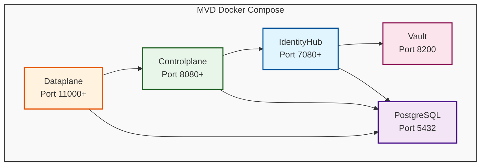

# MVD Single-Instance Docker Compose Deployment

This repository contains a single-instance Docker Compose deployment of the Eclipse Dataspace Components (EDC) Minimum Viable Dataspace (MVD), extracted from the [MVD Kubernetes deployment](https://github.com/eclipse-edc/MinimumViableDataspace).

## Overview

This deployment provides a complete, self-contained dataspace participant with:

- **IdentityHub**: Manages Verifiable Credentials and DIDs
- **Controlplane**: Orchestrates contract negotiations and manages policies
- **Dataplane**: Handles actual data transfers
- **PostgreSQL**: Persistent storage for all components
- **HashiCorp Vault**: Secure secret management

This deployment is designed to be easily extensible for communication with other dataspace participants deployed using the same or compatible EDC-based infrastructure.

## Architecture



## Prerequisites

- **Docker** and **Docker Compose** (v2.0+)
- **Task** (Taskfile task runner) - [Installation guide](https://taskfile.dev/installation/)
- **Git** (for cloning the MVD source repository)
- **curl** and **jq** (for seeding scripts)

## Quick Start

### 1. Setup MVD Source Repository

The deployment automatically clones and manages the EDC Minimum Viable Dataspace source repository. To set it up:

```bash
task setup
```

This will:
- Clone the MVD repository from GitHub (if not already present)
- Checkout the correct branch (`release/0.14.0` by default)
- Update to the latest commit on that branch

To check the current source status:

```bash
task info
```

### 2. Build Docker Images

Build the Docker images from the MVD source:

```bash
task build
```

This will:
- Automatically setup/update the MVD source (if needed)
- Build the Java components using Gradle
- Create Docker images with persistence enabled (`controlplane:latest`, `dataplane:latest`, `identity-hub:latest`)

### 3. Start Services

Start all services with Docker Compose:

```bash
task up
```

This starts:
- PostgreSQL database
- HashiCorp Vault
- IdentityHub
- Controlplane
- Dataplane

### 4. Seed the Dataspace

Initialize the dataspace with participant contexts and test data:

```bash
task seed
```

This creates:
- Participant context in IdentityHub
- DID document
- Test asset and policies
- Contract definition

### 5. Verify Deployment

Check that all services are healthy:

```bash
task health
```

Or view the DID document:

```bash
curl http://localhost:7083/.well-known/did.json
```

## Available Tasks

Run `task --list` to see all available tasks:

| Task | Description |
|------|-------------|
| `task setup` | Clone or update the MVD source repository |
| `task info` | Show MVD source directory and branch information |
| `task build` | Build Docker images from MVD source (auto-setup) |
| `task up` | Start all services |
| `task down` | Stop all services |
| `task restart` | Restart all services |
| `task status` | Show service status |
| `task logs` | Show logs for all services |
| `task logs-service SERVICE=<name>` | Show logs for specific service |
| `task seed` | Seed dataspace with initial data |
| `task health` | Check health of all services |
| `task clean` | Stop services and remove all data |
| `task rebuild` | Rebuild images and restart (auto-setup) |
| `task dev` | Development mode - rebuild and restart (auto-setup) |
| `task db` | Connect to PostgreSQL database |
| `task vault` | Check Vault status |
| `task backup` | Backup database |
| `task restore BACKUP=<file>` | Restore database from backup |

### Source Repository Management

The deployment automatically manages the EDC MVD source repository:

- **Repository**: https://github.com/eclipse-edc/MinimumViableDataspace
- **Default Location**: `../edc-minimum-viable-dataspace`
- **Default Branch**: `release/0.14.0`

The repository is automatically cloned and updated when needed. To customize:

**Change the branch or repository URL** - Edit `Taskfile.yml`:
```yaml
vars:
  MVD_BRANCH: main  # or any other branch
  MVD_REPO_URL: https://github.com/your-fork/MinimumViableDataspace
```

**Manual setup/update**:
```bash
task setup
```

**Check current status**:
```bash
task info
```

The source repository is gitignored and will not be committed to this repository.

## Service Endpoints

### IdentityHub
- Main API: http://localhost:7080/api
- Credentials API: http://localhost:7081/api/credentials
- Identity API: http://localhost:7082/api/identity
- DID endpoint: http://localhost:7083/
- STS API: http://localhost:7086/api/sts

### Controlplane
- Main API: http://localhost:8080/api
- Management API: http://localhost:8081/api/management (API Key: `password`)
- DSP Protocol: http://localhost:8082/api/dsp
- Control API: http://localhost:8083/api/control
- Catalog API: http://localhost:8084/api/catalog (API Key: `password`)

### Dataplane
- Public API: http://localhost:11001/api/public
- Control API: http://localhost:11002/api/control
- Main API: http://localhost:11003/api

### Infrastructure
- PostgreSQL: localhost:5432 (user: `mvd_user`, password: `mvd_password`, database: `mvd`)
- Vault: http://localhost:8200 (token: `root-token`)

## Configuration

### Environment Files

Service configurations are in `config/`:
- `identityhub.env` - IdentityHub settings
- `controlplane.env` - Controlplane settings
- `dataplane.env` - Dataplane settings

### Assets

Assets are in `assets/`:
- `credentials/` - Pre-seeded Verifiable Credentials
- `keys/` - Cryptographic keys (private/public key pairs)
- `participants/` - Participants list for federated catalog

## Interoperability with Other Participants

This deployment is designed to communicate with other EDC-based connectors. To establish connections:

### 1. Exchange DIDs

Your DID: `did:web:identityhub%3A7083`

Your DID document is available at: http://localhost:7083/.well-known/did.json

**Note**: For production deployments, this must be a publicly resolvable URL.

### 2. Configure Participant List

Add other participants to `assets/participants/participants.json`:

```json
{
  "mvd-participant": "did:web:identityhub%3A7083",
  "other-participant": "did:web:other-connector.example.com"
}
```

### 3. DSP Communication

Your DSP endpoint: http://localhost:8082/api/dsp

Other participants can communicate with you via the Dataspace Protocol (DSP) at this endpoint.

### 4. Credential Requirements

This deployment uses:
- **MembershipCredential**: Required for all DSP requests
- **DataProcessorCredential**: Required for contract negotiation (with levels: `processing` or `sensitive`)

Ensure your participant has the appropriate credentials to access assets from other participants.

## Example API Calls

### Query Catalog

```bash
curl http://localhost:8084/api/catalog \
  -H 'x-api-key: password'
```

### List Assets

```bash
curl http://localhost:8081/api/management/v3/assets \
  -H 'x-api-key: password'
```

### Create Asset

```bash
curl -X POST http://localhost:8081/api/management/v3/assets \
  -H 'x-api-key: password' \
  -H 'Content-Type: application/json' \
  -d '{
    "@context": {
      "@vocab": "https://w3id.org/edc/v0.0.1/ns/"
    },
    "@id": "my-asset",
    "properties": {
      "name": "My Asset",
      "contenttype": "application/json"
    },
    "dataAddress": {
      "@type": "DataAddress",
      "type": "HttpData",
      "baseUrl": "http://example.com/data"
    }
  }'
```

### View DID Document

```bash
curl http://localhost:7083/.well-known/did.json
```

## Data Persistence

### Volumes

Data is persisted in:
- `./data/postgres/` - PostgreSQL data
- `./data/vault/` - Vault data (in dev mode, not persisted)

### Backup and Restore

Create a backup:

```bash
task backup
```

Restore from backup:

```bash
task restore BACKUP=./backups/mvd-backup-YYYYMMDD-HHMMSS.sql
```

## Debugging

### Remote Debugging

All Java services have remote debugging enabled:
- IdentityHub: port 1044
- Controlplane: port 1045
- Dataplane: port 1046

Configure your IDE to connect to `localhost:<port>`.

### View Logs

All services:
```bash
task logs
```

Specific service:
```bash
task logs-service SERVICE=controlplane
```

### Database Access

```bash
task db
```

Or directly:
```bash
docker compose exec postgres psql -U mvd_user -d mvd
```

## Troubleshooting

### Services Not Starting

1. Check logs: `task logs`
2. Verify Docker is running: `docker ps`
3. Check disk space: `df -h`

### Seed Script Fails

1. Ensure services are healthy: `task health`
2. Wait 30 seconds after `task up` for services to fully initialize
3. Check IdentityHub logs: `task logs-service SERVICE=identityhub`

### Database Connection Issues

1. Restart services: `task restart`
2. Check PostgreSQL logs: `task logs-service SERVICE=postgres`
3. Verify database is initialized: `task db` and run `\dt` to list tables

### Cannot Connect to Other Participants

1. Ensure DID documents are publicly resolvable
2. Verify network connectivity
3. Check that credentials are properly configured
4. Review DSP logs: `task logs-service SERVICE=controlplane`

## Production Considerations

**IMPORTANT**: This deployment is for development/testing only. For production:

1. **Use HTTPS**: All endpoints must use TLS
2. **Secure Secrets**: Use proper Vault configuration (not dev mode)
3. **External Database**: Use managed PostgreSQL service
4. **Network Security**: Configure firewalls and network policies
5. **DID Resolution**: Ensure DIDs are publicly resolvable
6. **Credential Issuance**: Implement proper credential issuance flow
7. **Monitoring**: Add proper monitoring and alerting
8. **Backup Strategy**: Implement automated backups
9. **Resource Limits**: Configure appropriate CPU/memory limits
10. **API Authentication**: Use strong API keys and rotate regularly

## Directory Structure

```
eifede-mvds/
├── compose.yaml              # Docker Compose configuration
├── Taskfile.yml             # Task definitions
├── README.md                # This file
├── config/                  # Service configurations
│   ├── identityhub.env
│   ├── controlplane.env
│   └── dataplane.env
├── assets/                  # Static assets
│   ├── credentials/         # Verifiable credentials
│   ├── keys/               # Cryptographic keys
│   └── participants/       # Participant list
├── scripts/                # Helper scripts
│   ├── seed.sh            # Dataspace seeding
│   ├── init-db.sql        # Database initialization
│   └── create-test-asset.sh
├── data/                   # Persistent data (gitignored)
│   ├── postgres/
│   └── vault/
└── backups/               # Database backups (gitignored)
```

## Contributing

This deployment is derived from the [Eclipse EDC MVD](https://github.com/eclipse-edc/MinimumViableDataspace) project. Please refer to the upstream project for contribution guidelines.

## License

Apache License 2.0 - See LICENSE file for details

## Support

For issues related to:
- **This deployment**: Create an issue in this repository
- **EDC/MVD core**: See [EDC MinimumViableDataspace](https://github.com/eclipse-edc/MinimumViableDataspace)
- **EDC framework**: See [Eclipse Dataspace Components](https://github.com/eclipse-edc/Connector)

## Additional Resources

- [EDC Documentation](https://eclipse-edc.github.io/docs/)
- [MVD Demo](https://github.com/eclipse-edc/MinimumViableDataspace)
- [Dataspace Protocol](https://docs.internationaldataspaces.org/ids-knowledgebase/v/dataspace-protocol)
- [Decentralized Claims Protocol](https://github.com/eclipse-tractusx/identity-trust)
