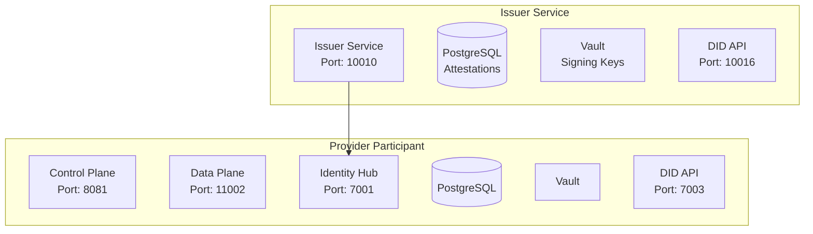

# Eclipse EDC Minimum Viable Dataspace

A complete deployment system for Eclipse EDC (Eclipse Dataspace Connector) participants with integrated identity management, credential issuance, and policy enforcement.

## Overview

This repository provides production-ready deployments for:

- **Provider Participant**: Data provider with Control Plane, Data Plane, and Identity Hub
- **Issuer Service**: Verifiable credential issuance and attestation management
- **Complete Dataspace Foundation**: Core components for data sharing with policy enforcement

### Key Features

- **Identity & Trust**: DID-based identity with verifiable credentials
- **Policy Enforcement**: Credential-based access control policies
- **Secure Communication**: TLS/HTTPS with cryptographic signatures
- **Production Ready**: Comprehensive security, monitoring, and deployment automation
- **Developer Friendly**: Local development with debugging support

## Quick Start

### Prerequisites

- **Docker** 20.10+ and **Docker Compose** 2.x
- **Python** 3.8+ with pip
- **Task** (recommended): `brew install go-task/tap/go-task`

### 1. Setup Environment

```bash
# Clone repository
git clone <repository-url>
cd <repository-name>

# Install Python dependencies
pip3 install -r requirements.txt

# Copy environment template
cp .env.example .env
# Edit .env with your configuration
```

### 2. Deploy Complete Dataspace

**Important**: Follow this order for initial deployment:

```bash
# Step 1: Build Docker images (required first time and after source updates)
task build

# Step 2: Deploy Issuer Service (credential authority)
# This must be deployed BEFORE the provider
task issuer:deploy

# Step 3: Deploy Provider Participant
# Depends on Issuer being available for credential requests
task provider:deploy
```

> **Note**: The Issuer Service must be running before deploying the Provider, as the Provider requests credentials during deployment.

### 3. Verify Deployment

```bash
# Check service status
task issuer:status
task provider:status

# Verify Issuer health
curl http://localhost:10010/api/check/health

# Verify Management API (replace <API_KEY> with your PROVIDER_MANAGEMENT_API_KEY from .env)
curl -H "X-Api-Key: <API_KEY>" http://localhost:8081/management/v3/assets
```

### Common Operations

```bash
# View service status
task issuer:status
task provider:status

# View logs
docker compose -p mvds-issuer logs -f
docker compose -p mvds-provider logs -f

# Restart services
task provider:restart

# Stop services
task issuer:down
task provider:down

# Clean up (removes all data)
task issuer:clean
task provider:clean
```

## Architecture



## Configuration

### Environment Variables

Key configuration in `.env`:

```bash
# Provider Identity
PROVIDER_PUBLIC_HOST=host.docker.internal
PROVIDER_PARTICIPANT_NAME=provider

# Issuer Service
ISSUER_PUBLIC_HOST=host.docker.internal
# Note: ISSUER_DID is auto-generated from ISSUER_PUBLIC_HOST:ISSUER_DID_API_PORT

# Security (⚠️ CHANGE FOR PRODUCTION!)
PROVIDER_MANAGEMENT_API_KEY=<your-secure-api-key>
ISSUER_SUPERUSER_KEY=<base64-username>.<base64-password>
```

### Port Allocation

| Service      | Component      | Port  | Purpose               |
| ------------ | -------------- | ----- | --------------------- |
| **Issuer**   | Main API       | 10010 | Health, status        |
|              | Admin API      | 10013 | Credential management |
|              | DID API        | 10016 | DID document          |
| **Provider** | Management API | 8081  | Asset management      |
|              | DSP Protocol   | 8082  | Inter-connector       |
|              | Public API     | 11002 | Data access           |
|              | Identity Hub   | 7001  | Credentials           |
|              | DID API        | 7003  | DID document          |


## Deployment Components

### Issuer Service

Issues verifiable credentials for dataspace participants.

**Credential Types:**
- **MembershipCredential**: Proves dataspace membership
- **DataProcessorCredential**: Attests data processing capabilities

### Provider Participant

Provides data assets with policy enforcement.

**Components:**
- **Control Plane**: Asset and contract management
- **Data Plane**: Secure data transfer
- **Identity Hub**: Credential storage and validation

## API Reference

### Management API

**Authentication**: API Key (`X-Api-Key` header)

```bash
# List assets
curl -H "X-Api-Key: <API_KEY>" http://localhost:8081/management/v3/assets

# Create asset
curl -X POST -H "X-Api-Key: <API_KEY>" -H "Content-Type: application/json" \
  http://localhost:8081/management/v3/assets \
  -d '{
    "@id": "sample-asset",
    "properties": {"description": "Sample data"},
    "dataAddress": {"type": "HttpData", "baseUrl": "https://api.example.com/data"}
  }'

# List policies
curl -H "X-Api-Key: <API_KEY>" http://localhost:8081/management/v3/policydefinitions

# List contracts
curl -H "X-Api-Key: <API_KEY>" http://localhost:8081/management/v3/contractdefinitions
```

### Identity Hub API

**Authentication**: API Key (`X-Api-Key` header)

```bash
# List credentials
curl -H "X-Api-Key: <API_KEY>" \
  "http://localhost:7001/api/identity/v1alpha/participants/did:web:host.docker.internal%3A7003:provider/credentials"

# Request token
curl -X POST http://localhost:7002/api/sts/token \
  -H "Content-Type: application/json" \
  -d '{"audience": "did:web:consumer.example.com", "scope": "read"}'
```

### Issuer Admin API

**Authentication**: Superuser Key (`X-Api-Key` header)

```bash
# List participants (replace <ISSUER_DID_ENCODED> with base64-encoded issuer DID)
curl -H "X-Api-Key: <SUPERUSER_KEY>" \
  "http://localhost:10013/api/admin/v1alpha/participants/<ISSUER_DID_ENCODED>/holders"

# List credential definitions
curl -H "X-Api-Key: <SUPERUSER_KEY>" \
  "http://localhost:10013/api/admin/v1alpha/participants/<ISSUER_DID_ENCODED>/credentialdefinitions"
```

## Security

### Production Security Checklist

**⚠️ CRITICAL: Change all default credentials before production!**

- [ ] **API Keys**: Generate strong random keys
  ```bash
  PROVIDER_MANAGEMENT_API_KEY=$(openssl rand -base64 32)
  ISSUER_SUPERUSER_KEY=$(echo -n "admin" | base64).$(openssl rand -base64 24)
  ```

- [ ] **Database Passwords**: Use strong passwords
  ```bash
  PROVIDER_DB_PASSWORD=$(openssl rand -base64 24)
  ISSUER_DB_PASSWORD=$(openssl rand -base64 24)
  ```

- [ ] **Vault Tokens**: Never use `root` in production
- [ ] **TLS/HTTPS**: Enable for production (set appropriate environment variables in config)
- [ ] **Network Security**: Restrict port access, use VPN for management
- [ ] **Key Management**: Use HSM for production keys
- [ ] **Monitoring**: Enable audit logging and monitoring

### Authentication Methods

1. **API Key Authentication**: Management and Catalog APIs
2. **Bearer Token Authentication**: DSP Protocol and Public APIs  
3. **Credential-Based Authorization**: Policy enforcement using verifiable credentials

## Troubleshooting

### Quick Diagnostics

```bash
# Check service status
task issuer:status
task provider:status

# View logs
docker compose -p mvds-issuer logs -f
docker compose -p mvds-provider logs -f

# Check specific service
docker logs mvd-issuer-service
docker logs mvd-provider-controlplane
docker logs mvd-provider-dataplane
docker logs mvd-provider-identityhub

# Test connectivity
curl http://localhost:8080/api/check/health  # Provider Control Plane
curl http://localhost:8090/api/check/health  # Provider Data Plane
curl http://localhost:7000/api/check/health  # Provider Identity Hub
curl http://localhost:10010/api/check/health # Issuer Service
```

## Development

### Development Setup

Debug ports are configured in `.env` and exposed automatically:
- Issuer Service: Port 1043
- Provider Control Plane: Port 1044
- Provider Data Plane: Port 1045
- Provider Identity Hub: Port 1046

Connect your IDE debugger to these ports after starting services with `task issuer:up` or `task provider:up`.

### Building from Source

```bash
# Setup/update source code
task setup-source

# Build EDC components and Docker images
task build
```

## Production Deployment

### Environment-Specific Configuration

**Development:**
```bash
PROVIDER_PUBLIC_HOST=host.docker.internal
```

**Production:**
```bash
PROVIDER_PUBLIC_HOST=provider.yourdomain.com
# Use strong authentication credentials (see Security section)
```

### Monitoring

```bash
# Health monitoring script
while true; do
  curl -f http://localhost:8080/api/check/health || echo "$(date): Provider CP health check failed"
  curl -f http://localhost:8090/api/check/health || echo "$(date): Provider DP health check failed"
  curl -f http://localhost:7000/api/check/health || echo "$(date): Provider IH health check failed"
  curl -f http://localhost:10010/api/check/health || echo "$(date): Issuer health check failed"
  sleep 60
done
```

## Support

### Getting Help

1. **Documentation**: Check troubleshooting section above
2. **Logs**: Collect logs using Docker Compose commands:
   - `docker compose -p mvds-issuer logs > issuer-logs.txt`
   - `docker compose -p mvds-provider logs > provider-logs.txt`
3. **GitHub Issues**: Search existing issues or create new one
4. **Community**: EDC community forums and discussions

### Issue Reporting

Include in your issue report:
- Environment details (OS, Docker version)
- Steps to reproduce
- Complete error logs
- Configuration (sanitized - remove secrets from `.env` file)

---

This deployment system provides a complete, production-ready Eclipse EDC dataspace with integrated identity management and credential-based policy enforcement.