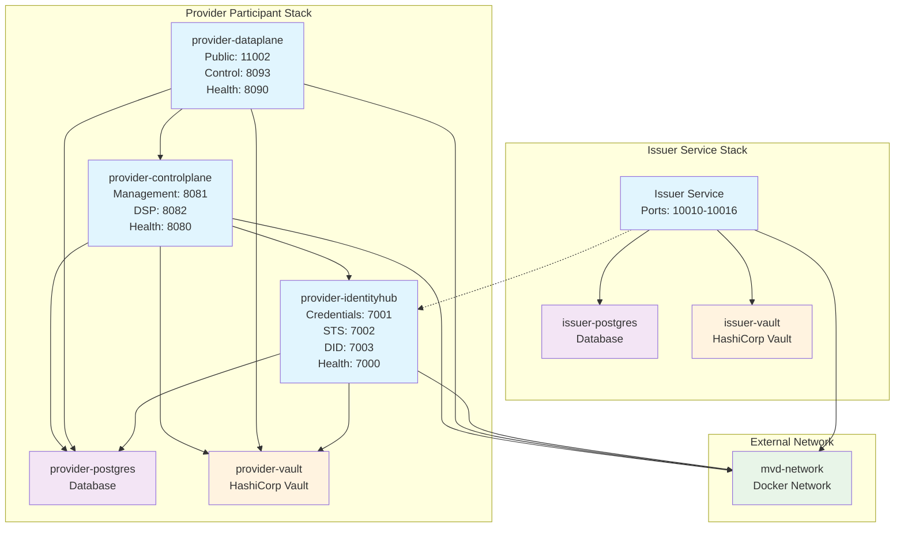
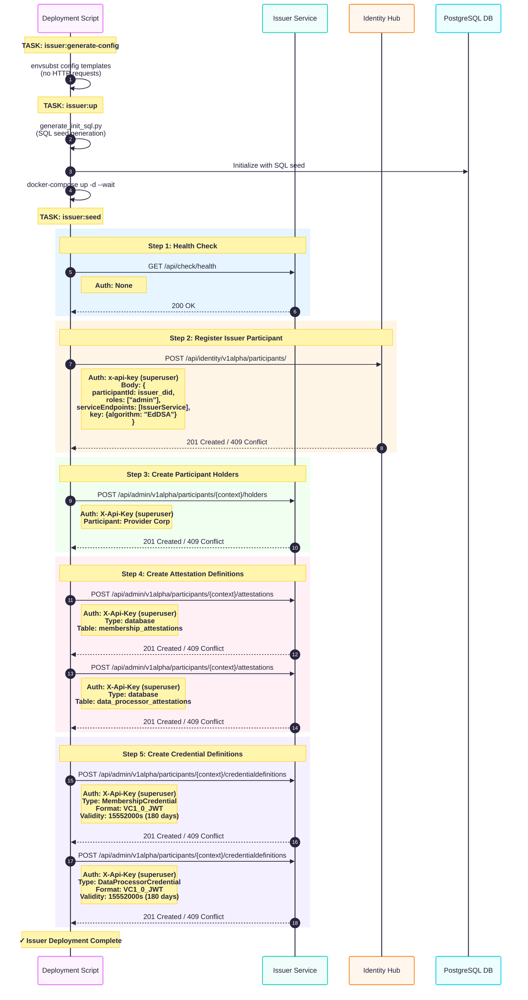

# Eclipse EDC Minimum Viable Dataspace

A port of the Eclipse Dataspace Components (EDC) Minimum Viable Dataspace (MVD) based on Docker Compose instead of Kubernetes. This version has been deeply refactored to facilitate parameterization and expose deployments to the Internet.

## Overview

This repository provides deployments for:

- **Provider Participant**: Data provider with Control Plane, Data Plane, and Identity Hub
- **Issuer Service**: Verifiable credential issuance and attestation management

## Quick Start

### Prerequisites

- **Docker** 20.10+ and **Docker Compose** 2.x
- **Python** 3.8+ with pip
- **Task** (recommended): `brew install go-task/tap/go-task`

### 1. Setup Environment

```bash
# Clone repository
git clone <repository-url>
cd <repository-name>

# Install Python dependencies
pip3 install -r requirements.txt

# Copy environment template
cp .env.example .env
# Edit .env with your configuration
```

### 2. Deploy Complete Dataspace

**Important**: Follow this order for initial deployment:

```bash
# Step 1: Build Docker images (required first time and after source updates)
task build

# Step 2: Deploy Issuer Service (credential authority)
# This must be deployed BEFORE the provider
task issuer:deploy

# Step 3: Deploy Provider Participant
# Depends on Issuer being available for credential requests
task provider:deploy
```

> **Note**: The Issuer Service must be running before deploying the Provider, as the Provider requests credentials during deployment.

## Architecture



## Configuration

### Environment Variables

Key configuration is stored in `.env` (example default configuration is available in `.env.example`).

## Deployment Components

### Issuer Service

Issues verifiable credentials for dataspace participants.

**Credential Types:**
- **MembershipCredential**: Proves dataspace membership
- **DataProcessorCredential**: Attests to data processing capabilities

### Provider Participant

Provides data assets with policy enforcement.

**Components:**
- **Control Plane**: Asset and contract management
- **Data Plane**: Secure data transfer
- **Identity Hub**: Credential storage and validation

## Deployment Sequence

### Issuer



### Provider

```mermaid
sequenceDiagram
  participant Script as Deployment Script
  participant CP as Control Plane
  participant DP as Data Plane
  participant IH as Provider Identity Hub
  participant Vault as Vault
  participant Issuer as Issuer Service
  autonumber
  Note over Script: TASK: provider:up
  rect rgb(250, 250, 250)
    Note over Script: Dependency: build
    Script ->> Script: ./gradlew clean build
    Script ->> Script: ./gradlew dockerize
  end
  rect rgb(245, 250, 255)
    Note over Script: Dependency: provider:configure
    Script ->> Script: provider:generate-config (envsubst)
    Script ->> Script: provider:validate-config
    Script ->> Script: configure_controlplane.py
    Script ->> Script: configure_dataplane.py
    Script ->> Script: configure_identityhub.py
  end
  Script ->> Script: docker-compose up -d --wait
  Note over Script: TASK: provider:seed
  rect rgb(230, 245, 255)
    Note over Script, CP: Step 1: Health Check
    Script ->> CP: GET /api/check/health
    Note right of Script: Auth: None
    CP -->> Script: 200 OK
  end
  rect rgb(255, 245, 230)
    Note over Script, IH: Step 2: Register Provider Participant
    Script ->> IH: POST /api/identity/v1alpha/participants/
    Note right of Script: Auth: x-api-key (superuser)<br/>participantId: provider_did<br/>roles: []<br/>serviceEndpoints: CredentialService + ProtocolEndpoint<br/>key.algorithm: EC
    IH -->> Script: 201 Created + clientSecret
    Note left of IH: Returns STS client secret
  end
  rect rgb(255, 250, 240)
    Note over Script, Vault: Step 3: Store STS Client Secret
    Script ->> CP: POST /api/management/v3/secrets
    Note right of Script: Auth: x-api-key (management)<br/>@id: provider-sts-client-secret<br/>value: clientSecret from Step 2
    CP ->> Vault: Store secret in Vault
    CP -->> Script: 201 Created / 409 Conflict
  end
  rect rgb(240, 255, 240)
    Note over Script, CP: Step 4: Create Data Assets
    Script ->> CP: POST /api/management/v3/assets
    Note right of Script: Auth: x-api-key (management)<br/>@id: asset-1<br/>type: HttpData<br/>baseUrl: jsonplaceholder
    CP -->> Script: 200 OK / 409 Conflict
    Script ->> CP: POST /api/management/v3/assets
    Note right of Script: Auth: x-api-key (management)<br/>@id: asset-2<br/>type: HttpData<br/>baseUrl: jsonplaceholder
    CP -->> Script: 200 OK / 409 Conflict
  end
  rect rgb(255, 240, 245)
    Note over Script, CP: Step 5: Create Policy Definitions
    Script ->> CP: POST /api/management/v3/policydefinitions
    Note right of Script: Auth: x-api-key (management)<br/>@id: allow-all<br/>permission.action: use
    CP -->> Script: 200 OK / 409 Conflict
    Script ->> CP: POST /api/management/v3/policydefinitions
    Note right of Script: Auth: x-api-key (management)<br/>@id: require-membership<br/>constraint: MembershipCredential eq active
    CP -->> Script: 200 OK / 409 Conflict
    Script ->> CP: POST /api/management/v3/policydefinitions
    Note right of Script: Auth: x-api-key (management)<br/>@id: require-dataprocessor<br/>constraint: DataAccess.level eq processing
    CP -->> Script: 200 OK / 409 Conflict
    Script ->> CP: POST /api/management/v3/policydefinitions
    Note right of Script: Auth: x-api-key (management)<br/>@id: require-sensitive<br/>constraint: DataAccess.level eq sensitive
    CP -->> Script: 200 OK / 409 Conflict
  end
  rect rgb(245, 240, 255)
    Note over Script, CP: Step 6: Create Contract Definitions
    Script ->> CP: POST /api/management/v3/contractdefinitions
    Note right of Script: Auth: x-api-key (management)<br/>@id: simple-access-def<br/>accessPolicyId: allow-all<br/>contractPolicyId: allow-all<br/>assetSelector: asset-1
    CP -->> Script: 200 OK / 409 Conflict
    Script ->> CP: POST /api/management/v3/contractdefinitions
    Note right of Script: Auth: x-api-key (management)<br/>@id: sensitive-only-def<br/>accessPolicyId: require-membership<br/>contractPolicyId: require-sensitive<br/>assetSelector: asset-2
    CP -->> Script: 200 OK / 409 Conflict
  end
  rect rgb(250, 245, 245)
    Note over Script, CP: Step 7: Verify Seeded Data
    Script ->> CP: POST /api/management/v3/assets/request
    Note right of Script: Auth: x-api-key (management)<br/>body: QuerySpec
    CP -->> Script: 200 OK (array of assets)
    Script ->> CP: POST /api/management/v3/policydefinitions/request
    Note right of Script: Auth: x-api-key (management)<br/>body: QuerySpec
    CP -->> Script: 200 OK (array of policies)
    Script ->> CP: POST /api/management/v3/contractdefinitions/request
    Note right of Script: Auth: x-api-key (management)<br/>body: QuerySpec
    CP -->> Script: 200 OK (array of contracts)
  end
  Note over Script: TASK: provider:request-credentials
  rect rgb(240, 245, 255)
    Note over Script, Issuer: Step 8: Request Verifiable Credentials
    Script ->> IH: POST /api/identity/v1alpha/participants/{base64_did}/credentials/request
    Note right of Script: Auth: x-api-key (superuser)<br/>issuerDid: issuer_did<br/>credentials: MembershipCredential + DataProcessorCredential
    IH ->> Issuer: Forward credential request
    IH -->> Script: 202 Accepted<br/>Location header with status URL
  end
  rect rgb(230, 240, 255)
    Note over Script, IH: Step 9: Poll Credential Status
    loop Poll until ISSUED (max 30 attempts)
      Script ->> IH: GET /api/identity{location_path}
      Note right of Script: Auth: x-api-key (superuser)
      IH -->> Script: 200 OK (status: PENDING)
    end
    Script ->> IH: GET /api/identity{location_path}
    Note right of Script: Auth: x-api-key (superuser)
    IH -->> Script: 200 OK (status: ISSUED)
    Note left of IH: Credentials stored<br/>in Identity Hub
  end
  Note over Script: ✓ Provider Deployment Complete
```

