# Eclipse Dataspace Components (EDC) — Minimum Viable Dataspace (MVD)

**Single-instance Docker Compose deployment** of the Eclipse Dataspace Components (EDC) Minimum Viable Dataspace, designed for **development**, **testing**, and **proof-of-concept** dataspace scenarios.

---

## 🚀 Quick Start

```bash
# 1. Configure environment
cp .env.example .env
# Edit .env as needed (defaults work for development)

# 2. Build and start all services
task build
task up
task seed

# 3. Verify your participant is running
task status
curl http://localhost:7083/.well-known/did.json
```

Your dataspace participant is now live and seeded with example data.

---

## 🧩 Prerequisites

* Docker & Docker Compose v2.0+
* [Task](https://taskfile.dev/installation/)
* Git, curl, jq, envsubst (typically preinstalled)

### Linux Environment Setup

**Docker Desktop Users (Recommended):**
Docker Desktop automatically provides `host.docker.internal` hostname resolution. No additional configuration needed.

**Linux without Docker Desktop:**
If you're running Docker Engine directly on Linux (without Docker Desktop), you'll need to add hostname resolution for `host.docker.internal`:

```bash
# Quick setup: Add to docker-compose command
docker-compose --add-host=host.docker.internal:host-gateway up

# Alternative: Add to /etc/hosts
echo "127.0.0.1 host.docker.internal" | sudo tee -a /etc/hosts
```

---

## ⚙️ Configuration Overview

All configuration is centralized in `.env`, the **single source of truth** for:

* Participant identity (DID)
* API keys and tokens
* Database credentials
* Port mappings
* Issuer service mode (`local` or `external`)

### Create & Customize `.env`

```bash
cp .env.example .env
# Edit values as needed
```

**Key variables:**

| Variable                  | Description           | Example                      |
| ------------------------- | --------------------- | ---------------------------- |
| `PARTICIPANT_DID`         | Participant DID       | `did:web:identityhub%3A7083` |
| `ISSUER_MODE`             | `local` or `external` | `local`                      |
| `MANAGEMENT_API_KEY`      | Management API key    | `password` (change in prod!) |
| `DB_USER` / `DB_PASSWORD` | Database credentials  | `mvd_user` / `mvd_password`  |

> 💡 For production, update all credentials, tokens, and DIDs to use **public DNS** and **strong secrets**.

### Configuration Flow

```
.env (user config)
   ↓
   ├─ Docker Compose (via ${VAR})
   ├─ Generated config templates
   └─ Service scripts (source .env)
```

When you run `task up` or `task generate-config`, configuration files are generated:

* `config/identityhub.env`
* `config/controlplane.env`
* `config/dataplane.env`
* `config/issuer-service.env` *(if `ISSUER_MODE=local`)*
* `assets/participants/participants.json`

> ⚠️ **Do not edit generated files.** Modify `.env` and regenerate with `task generate-config`.

---

## 🏗️ Architecture

```mermaid
graph TB
    subgraph MVD["MVD Single Instance"]
        IH["IdentityHub<br/>7080–7083<br/>VCs & DIDs"]
        CP["Controlplane<br/>8080–8084<br/>DSP Protocol"]
        DP["Dataplane<br/>11000+<br/>Data Transfer"]
        PG["PostgreSQL<br/>5432"]
        V["Vault<br/>8200"]

        DP --> CP
        CP --> IH
        IH --> PG
        IH --> V
        CP --> PG
        DP --> PG
        CP --> V
        DP --> V
    end
```



**Core Components**

| Component        | Purpose                     | Port   |
| ---------------- | --------------------------- | ------ |
| **IdentityHub**  | DID & Credential Management | 7080+  |
| **Controlplane** | DSP & Policy Enforcement    | 8080+  |
| **Dataplane**    | Data Transfer Handling      | 11000+ |
| **PostgreSQL**   | Persistent Storage          | 5432   |
| **Vault**        | Secret Management           | 8200   |

---

## 🔐 Issuer Service (Optional)

The **Issuer Service** issues **Verifiable Credentials (VCs)** for dataspace participants.

### Modes

| Mode         | Description                       | Example Config         |
| ------------ | --------------------------------- | ---------------------- |
| **Local**    | Runs issuer stack locally for dev | `ISSUER_MODE=local`    |
| **External** | Uses remote issuer endpoint       | `ISSUER_MODE=external` |

#### Local Mode Example

```bash
ISSUER_MODE=local
ISSUER_DID=did:web:localhost%3A9876
ISSUER_PUBLIC_HOST=localhost
ISSUER_PUBLIC_PORT=9876
```

#### External Mode Example

```bash
ISSUER_MODE=external
ISSUER_DID=did:web:issuer.yourdomain.com
ISSUER_EXTERNAL_STS_URL=https://issuer.yourdomain.com/api/sts
ISSUER_EXTERNAL_ISSUANCE_URL=https://issuer.yourdomain.com/api/issuance
```

### Issuer Setup Commands

```bash
task generate-issuer-keys   # Create DID and keypair
task build-issuer           # Build issuer service
task configure-issuer       # Initialize config and Vault
task issuer-up              # Start issuer stack
task seed-issuer            # Seed attestation DB
task request-credential     # Request MembershipCredential
```

### Credential Flow

```mermaid
sequenceDiagram
    participant Participant
    participant IdentityHub
    participant Issuer
    Participant->>IdentityHub: Request credential
    IdentityHub->>Issuer: Forward credential request
    Issuer->>IdentityHub: Validate + issue VC
    IdentityHub->>Participant: Store + return credential
```

---

## 🧰 Essential Commands

```bash
# Configuration
task generate-config    # Generate from .env
task validate-env       # Check required vars

# Build & Run
task build              # Build all Docker images
task up                 # Start services
task down               # Stop services
task restart            # Restart stack

# Data & Monitoring
task seed               # Seed participant data
task status             # View container status
task logs               # Tail logs (all services)

# Maintenance
task backup             # Backup PostgreSQL
task restore BACKUP=... # Restore backup
task clean              # Remove all data

# Dev Utilities
task db                 # Open PostgreSQL shell
task vault              # Check Vault status
task shell SERVICE=...  # Open container shell
```

---

## 🌐 Default Endpoints

| Service              | URL                                          | Auth                  |
| -------------------- | -------------------------------------------- | --------------------- |
| **Management API**   | `http://localhost:8081/api/management`       | `x-api-key: password` |
| **Catalog API**      | `http://localhost:8084/api/catalog`          | `x-api-key: password` |
| **DSP Endpoint**     | `http://localhost:8082/api/dsp`              | DSP Auth              |
| **DID Document**     | `http://localhost:7083/.well-known/did.json` | Public                |
| **Dataplane Public** | `http://localhost:11001/api/public`          | Token                 |

---

## 🔗 Connecting to Other Participants

1. **Share DIDs**

   Your DID:
   `did:web:identityhub%3A7083`
   DID Document:
   `http://localhost:7083/.well-known/did.json`

2. **Add Peers**

   Edit `assets/participants/participants.json`:

   ```json
   {
     "mvd-participant": "did:web:identityhub%3A7083",
     "partner-company": "did:web:partner.example.com"
   }
   ```

3. **Verify Credentials**

   Required:

   * `MembershipCredential` (dataspace membership)
   * `DataProcessorCredential` (data handling permission)

---

## 💾 Development & Debugging

| Action         | Command                    |
| -------------- | -------------------------- |
| Debug services | Remote ports: 1044–1046    |
| Inspect DB     | `task db` → `\dt`          |
| View assets    | `SELECT * FROM edc_asset;` |
| Rebuild source | `task rebuild`             |
| Reset data     | `task clean && task up`    |

---

## 🧱 Project Structure

```
eifede-mvds/
├── compose.yaml
├── Taskfile.yml
├── config/
│   ├── *.env
├── assets/
│   ├── credentials/
│   ├── keys/
│   └── participants/
├── scripts/
├── edc-mvds/        # Auto-cloned MVD source
└── backups/
```

---

## ⚠️ Production Notes

Before deploying:

* [ ] Replace all default keys, tokens, passwords
* [ ] Use **HTTPS** for all endpoints
* [ ] Configure Vault with persistent storage
* [ ] Use managed PostgreSQL
* [ ] Ensure DIDs are publicly resolvable
* [ ] Disable debug ports
* [ ] Add monitoring, backup, and resource limits

---

## 📚 Resources

* [Eclipse Dataspace Components](https://github.com/eclipse-edc/Connector)
* [EDC Minimum Viable Dataspace](https://github.com/eclipse-edc/MinimumViableDataspace)
* [EDC Documentation](https://eclipse-edc.github.io/docs/)
* [Dataspace Protocol](https://docs.internationaldataspaces.org/)
